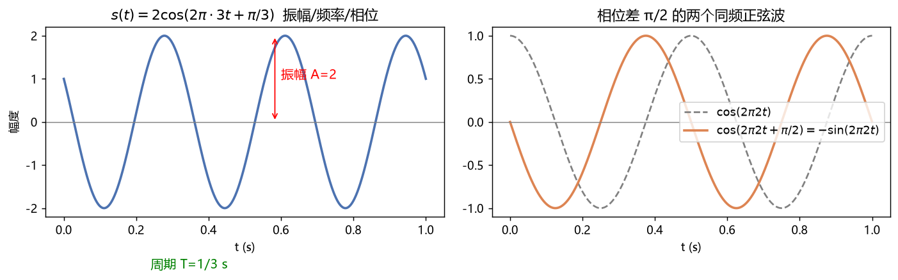

# 01 数学基础 —— 通信工程常用数学（新手友好版）

> 通信工程的所有专业课，归根到底用的就是这一章的数学。把这里弄懂，后面的课会轻松一半。

---

## 一、这门数学在通信里干什么用？

| 数学工具 | 用在哪门课 | 一句话说明 |
|---|---|---|
| 复数与欧拉公式 | 信号与系统、通信原理 | 把"正弦波"变成"指数"，乘除变加减，算起来飞快 |
| 傅里叶分析 | 信号与系统、DSP、通信原理 | 把任意信号拆成无数个正弦波的和（看频率成分） |
| 概率与随机过程 | 通信原理、信息论 | 噪声是随机的，误码率是概率 |
| 分贝 dB | 所有课 | 工程上表示超大/超小的比值 |
| 微积分/级数 | 全部 | 求面积（能量）、求变化率（带宽） |

---

## 二、复数与相量（必须滚瓜烂熟）

### 2.1 复数的三种写法

设复数 z = 3 + 4j：

- **代数式**：z = 3 + 4j（实部 3，虚部 4）
- **指数/极坐标式**：z = r·e^(jθ)，其中模 r = √(3²+4²) = **5**，辐角 θ = arctan(4/3) ≈ **53.1°**
- **三角式**：z = r(cosθ + j·sinθ)

**换算口诀**：模 = 勾股定理，角 = 反正切。

### 2.2 欧拉公式（通信第一公式）

$$e^{j\theta} = \cos\theta + j\sin\theta$$

由它立刻得到两个超级常用的变形：

$$\cos\theta = \frac{e^{j\theta}+e^{-j\theta}}{2}, \qquad \sin\theta = \frac{e^{j\theta}-e^{-j\theta}}{2j}$$

**为什么重要**：正弦信号 cos(ωt+φ) 可以写成 Re{e^(j(ωt+φ))}。信号通过系统（滤波器、信道）时，用 e^(jω) 表示，"微分"变成"乘 jω"，整个计算变成代数乘除。

### 2.3 例题 1：复数运算

**题目**：已知 A = 3+4j，B = 5e^(j30°)。求 A×B 和 A/B 的模与辐角。

**详解**：
1. 乘除法用"指数式"最方便：模相乘除、角相加减。
2. A 的指数式：A = 5e^(j53.1°)。
3. A×B：模 = 5×5 = 25；角 = 53.1°+30° = 83.1° → **25e^(j83.1°)**
4. A/B：模 = 5/5 = 1；角 = 53.1°−30° = 23.1° → **1e^(j23.1°)**

> **易错点**：加减用代数式，乘除用指数式。硬用代数式做乘除会算到怀疑人生。

---

## 三、正弦信号的三要素

见下图（图01）：一个正弦波由三个参数完全决定——

$$s(t) = A\cos(2\pi f t + \varphi)$$

| 参数 | 名称 | 单位 | 意义 |
|---|---|---|---|
| A | 振幅 | V 或 A | 波的最大高度（能量 ∝ A²） |
| f | 频率 | Hz | 每秒重复多少次；角频率 ω=2πf（rad/s） |
| φ | 初相位 | rad | 波形左右的"平移量" |

**记忆**：周期 T = 1/f。例如 f = 3Hz → T = 1/3 秒。

### 例题 2：频率-波长换算

**题目**：手机 5G 信号频率 3.5GHz，电波以光速 c = 3×10⁸ m/s 传播，波长是多少？

**详解**：λ = c/f = (3×10⁸)/(3.5×10⁹) = 0.0857 m ≈ **8.6 cm**。
（这就是为什么 5G 基站要建得密——波长越短，绕过障碍物的能力越差，覆盖越小。）

---

## 四、分贝（dB）—— 工程师的"倍数语言"

### 4.1 定义

$$\text{功率比(dB)} = 10\lg\frac{P_2}{P_1}, \qquad \text{电压/电流比(dB)} = 20\lg\frac{V_2}{V_1}$$

（电压用 20 是因为功率 ∝ 电压的平方，平方提出来系数×2。）

### 4.2 必背换算表

| 比值 | 功率 dB | 比值 | 功率 dB |
|---|---|---|---|
| ×1 | 0 dB | ×1/2 | −3 dB |
| ×10 | 10 dB | ×1/10 | −10 dB |
| ×100 | 20 dB | ×1000 | 30 dB |

> **生活应用**："这个功放功率大 3dB" = 功率翻倍。"信号衰减 20dB" = 只剩 1%。

### 4.3 例题 3：dBm（以 1mW 为基准的绝对功率单位）

**题目**：手机发射功率 200 mW，是多少 dBm？接收机灵敏度 −100 dBm 合多少瓦？

**详解**：
1. 200 mW = 10·lg(200/1) dBm = 10·lg200 = 10×2.301 = **23 dBm**。
2. −100 dBm：P = 1mW×10^(−100/10) = 10^(−10) mW = **10⁻¹³ W**（0.1 皮瓦，可见接收机多灵敏！）。

---

## 五、傅里叶分析（思想先行，细节在"信号与系统"）

**核心思想**：任何信号都能表示成不同频率正弦波的叠加。

- **周期信号** → 傅里叶**级数**：离散的谱线（基波 + 谐波），见下图方波例子（图02）；
- **非周期信号** → 傅里叶**变换**：连续的频谱。

周期方波的谱线幅度按 1/n 衰减、只含奇次谐波——这是考试高频考点（见信号与系统详解）。

### 例题 4：带宽的直观理解

**题目**：为什么电话音质"听不清音乐"？

**详解**：传统电话只传 300~3400 Hz 的频率成分（带宽约 3.1kHz），而音乐的高频成分（镲片、高音）可达 16kHz 以上——高频被"砍掉"了，所以听起来发闷。**带宽 = 传信息的能力**，这是通信第一定律（香农公式）的直观来源。

---

## 六、概率论速成（够用版）

### 6.1 必会概念

- **概率 P(A)**：事件 A 发生的可能性，0≤P≤1。
- **概率密度函数 pdf**：连续随机变量的"可能性分布曲线"，曲线下总面积 = 1。
- **期望 E[X]（均值 μ）**：随机变量的"平均水平"。
- **方差 σ² = E[(X−μ)²]**：波动大小；σ 叫标准差。

### 6.2 高斯分布（正态分布）——噪声的标准模型

$$f(x)=\frac{1}{\sqrt{2\pi}\sigma}e^{-\frac{(x-\mu)^2}{2\sigma^2}}$$

通信里的热噪声就是均值为 0 的高斯分布，叠加后仍是高斯（中心极限定理）——这就是"加性高斯白噪声信道 AWGN"的由来（"白"指功率谱像白光一样平坦）。

**3σ 原则**：高斯变量落在 μ±3σ 内的概率约 99.7%。

### 6.3 例题 5：误码率就是概率

**题目**：BPSK 系统中，发"1"时接收电压是 +1V 加上 σ=0.5V 的噪声，判决门限 0V。求发"1"却判成"0"的错误概率。

**详解**：
1. 接收值 r = 1 + n，n~N(0, 0.5²)。判错条件：r < 0，即 n < −1。
2. 标准化：z = −1/0.5 = −2，即求 Φ(−2)（标准正态在 −2 左侧的面积）。
3. 查表：Φ(−2) ≈ 0.0228 → **误码率约 2.28%**。
4. 怎么降低？增大信号（1V→2V）或减小噪声 σ——这就是"提高信噪比降低误码率"的本质。

### 6.4 例题 6：Q 函数与 erfc（通信原理必考）

**关系式**：Q(x) = ½·erfc(x/√2)。Q(2)=0.0228，Q(4)≈3.17×10⁻⁵。

数字通信误码率公式几乎全是 Q(√(γ)) 的形式，γ 是信噪比类变量。记住：**γ 每提高，Q 的自变量变大，误码率指数级下降**——所以误码率曲线画在半对数坐标上是"瀑布形"陡降（见通信原理 BER 曲线图 15）。

---

## 七、常用微积分结论（背下来）

| 需求 | 结论 |
|---|---|
| 正弦平均功率 | cos²(ωt) 的平均值 = 1/2，所以 P = A²/2（A 为振幅，1Ω 上） |
| sin·cos 正交 | 一个周期内积分为 0 —— 正交频分复用 OFDM 的数学根基 |
| e^(at) 的积分 | ∫e^(at)dt = e^(at)/a —— 一阶 RC 电路求解核心 |
| 卷积的拉氏变换 | L{x*y} = X(s)·Y(s) —— 卷积变乘法，系统分析的灵魂 |

---

## 八、本章自测（答案见文末）

1. 复数 −1−j 的模和辐角（主值）？
2. 功率放大 40dB 是多少倍？
3. cos(2π·1000t) 的角频率是多少 rad/s？
4. σ 减半后，例题 5 的误码概率变为？（z = −1/0.25 = −4 → Q(4) ≈ 3.17×10⁻⁵）

> **答案**：1. r=√2，θ=−135°（第三象限）；2. 10⁴ = 10000 倍；3. ω=2π×1000≈6283 rad/s；4. 3.17×10⁻⁵，即约十万分之三。

---

## 相关章节
- 下一章：[02-电路分析](../02-电路分析/知识点与例题详解.md)
- 傅里叶展开细节 → [05-信号与系统](../05-信号与系统/知识点与例题详解.md)
- 概率与噪声 → [07-通信原理](../07-通信原理/知识点与例题详解.md)
