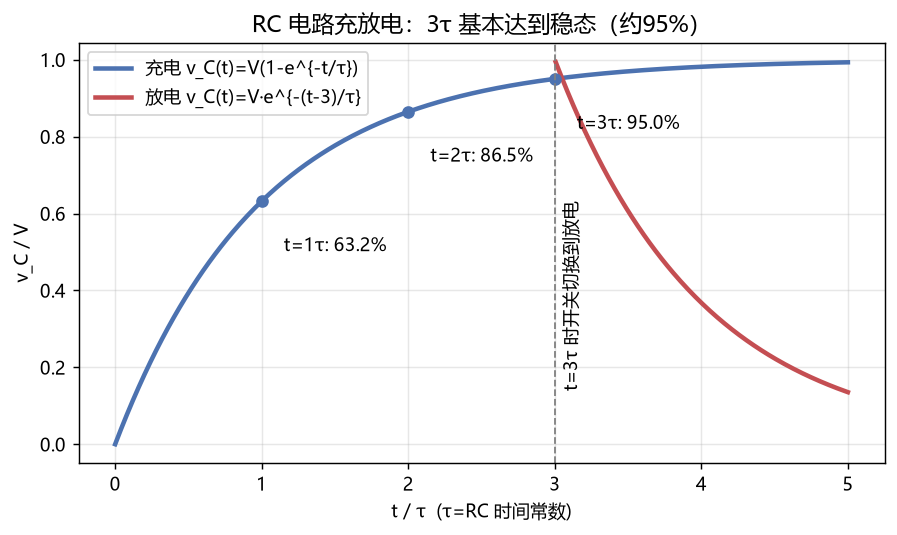

# 02 电路分析基础 —— 知识点与例题详解

> 电路是通信硬件的地基：手机、基站、路由器拆开全是电路。本章按"基本量 → 基本定律 → 基本方法 → 动态电路 → 正弦稳态"的顺序展开。

---

## 一、知识地图

```
电路分析
├── 基本物理量：电压 U、电流 I、功率 P=UI
├── 基本元件：电阻R / 电容C / 电感L / 电源
├── 基尔霍夫定律：KCL(节点电流) + KVL(回路电压)
├── 等效变换：串并联 / 分压分流 / 戴维南定理
├── 动态电路：RC/RL 一阶电路（充放电、时间常数τ）
└── 正弦稳态：相量法、阻抗、谐振、功率因数
```

---

## 二、基本物理量（先把方向搞对）

| 量 | 符号 | 单位 | 类比水流 |
|---|---|---|---|
| 电压 | U | 伏特 V | 水压差 |
| 电流 | I | 安培 A | 水流大小 |
| 电阻 | R | 欧姆 Ω | 水管粗细（阻碍） |
| 功率 | P = UI | 瓦特 W | 每秒流过的能量 |

**关联参考方向**：电流从电压"+"端流入为正方向。计算结果为负只说明实际方向与假设相反——不是错误！

---

## 三、三大元件的伏安关系（背）

| 元件 | 伏安关系 | 记忆点 |
|---|---|---|
| 电阻 | u = R·i | 即刻响应，耗能 P = i²R |
| 电容 | i = C·du/dt | 电压不能突变；隔直流、通交流；储能 W=½Cu² |
| 电感 | u = L·di/dt | 电流不能突变；通直流、阻交流；储能 W=½Li² |

> **通信视角**：电容电感是"频率选择"的源头——频率越高，电容越"通"（容抗 1/ωC 越小），电感越"堵"（感抗 ωL 越大）。所有滤波器的原理都源于此。

---

## 四、基尔霍夫定律（电路的"交通规则"）

- **KCL（电流定律）**：任一节点，流入电流 = 流出电流。∑I = 0。（电荷守恒）
- **KVL（电压定律）**：任一回路，电压升 = 电压降。∑U = 0。（能量守恒）

### 例题 1：KCL 求未知电流

**题目**：节点 A 流入电流 3A 和 2A，流出 4A 和 I。求 I。

**详解**：流入 = 流出 → 3+2 = 4+I → **I = 1A**（方向为流出 A）。

### 例题 2：KVL + 欧姆定律

**题目**：12V 电源接 R1=2Ω 与 R2=4Ω 串联。求各电阻电压和电路功率。

**详解**：
1. 总电阻 R = 2+4 = 6Ω；
2. 电流 I = 12/6 = **2A**（串联电流处处相等）；
3. U1 = 2×2 = 4V，U2 = 2×4 = 8V（验证 KVL：4+8=12 ✓）；
4. 功率 P = 12×2 = 24W。

---

## 五、等效与分压分流（做题提速器）

- 串联分压：U1 = U·R1/(R1+R2)
- 并联分流：I1 = I·R2/(R1+R2)（注意分子是**对方**电阻）
- 两电阻并联：R = R1R2/(R1+R2)（"积除和"）

### 例题 3：分压公式

**题目**：5V 电压经 R1=1kΩ、R2=3kΩ 分压，取 R2 上电压。U2=？

**详解**：U2 = 5 × 3/(1+3) = **3.75V**。
（这就是最原始的 DAC 思想！配合开关切换电阻网络，就是数电里 R-2R 型 D/A 转换器。）

### 例题 4：戴维南定理（把复杂网络变成一个电源+一个电阻）

**题目**：含源二端网络开路电压 10V，短路电流 2A。接 8Ω 负载后负载电流是多少？

**详解**：
1. 戴维南等效：Uoc = 10V，R0 = Uoc/Isc = 10/2 = 5Ω；
2. 接 8Ω：I = 10/(5+8) ≈ **0.77A**。
3. 戴维南的意义：不管网络内部多复杂，对外就表现为"一个理想电压源串联一个内阻"。最大功率传输时要求 R_L = R0（负载匹配，射频电路必考）。

---

## 六、一阶动态电路（RC 充放电）



**核心公式**（三要素法）：f(t) = f(∞) + [f(0⁺)−f(∞)]·e^(−t/τ)，τ = RC

- 充电：v_C(t) = V(1−e^(−t/τ))
- 放电：v_C(t) = V·e^(−t/τ)
- 时间常数 τ 越大充放电越慢；**3τ 达 95%，5τ 达 99%**（工程认为结束）

### 例题 5：时间常数

**题目**：R=10kΩ，C=100μF，充电到 63.2% 需多久？

**详解**：τ = RC = 10×10³ × 100×10⁻⁶ = 1s。t=τ 时恰好充到 63.2% → **1 秒**。

### 例题 6：RC 低通/高通（引出滤波器）

**题目**：图21 的 RC 电路，R 输出为高通还是电容输出为高通？

**详解**：
1. 从**电容**取输出：低通。因为频率越高容抗越小，电容上分到的电压越小，高频被"短路掉"。
2. 从**电阻**取输出：高通。高频时 R 分到大电压。
3. 截止频率 f_c = 1/(2πRC)。设 R=1.6kΩ、C=0.1μF → f_c = 1/(2π×1600×10⁻⁷) ≈ **1kHz**。
> 这就是"信号与系统"里滤波器的电路实现（对应图05）。

---

## 七、正弦稳态与相量法

用相量把微分方程变成代数方程：u(t)=U_m·cos(ωt+φ) ↔ 相量 U̇ = U_m∠φ

**复阻抗**：Z_R = R；Z_C = 1/(jωC)；Z_L = jωL

| 元件 | 电压电流相位关系 | 记忆 |
|---|---|---|
| R | 同相 | 电阻"不闹脾气" |
| C | 电流超前电压 90° | "电流先行"（电容先充上电流） |
| L | 电压超前电流 90° | "电压先行"（电感反抗电流变化） |

### 例题 7：RLC 串联阻抗

**题目**：R=30Ω，L=0.1mH，C=100nF 串联，f=100kHz。求总阻抗。

**详解**：
1. ωL = 2π×10⁵×10⁻⁴ ≈ 62.8Ω；
2. 1/(ωC) = 1/(2π×10⁵×10⁻⁷) ≈ 15.9Ω；
3. Z = R + j(ωL − 1/ωC) = 30 + j(62.8−15.9) = 30 + j46.9；
4. |Z| = √(30²+46.9²) ≈ **55.7Ω**，阻抗角 = arctan(46.9/30) ≈ 57.4°（感性）。

### 例题 8：串联谐振（选台原理！）

**题目**：上题电路在什么频率发生谐振？品质因数 Q=？

**详解**：
1. 谐振条件：ωL = 1/ωC → f0 = 1/(2π√(LC))；
2. f0 = 1/(2π√(10⁻⁴×10⁻⁷)) = 1/(2π×10⁻⁵.⁵) ≈ **50.3kHz**；
3. Q = ω0L/R = 2π×50300×10⁻⁴/30 ≈ **1.05**。
> **这就是收音机选台**：调节 C 使电路谐振在目标电台频率，该频率信号在电容上被放大 Q 倍，其他台被抑制。Q 越大选择性越好（通带 B = f0/Q）。

---

## 八、功率与功率因数

- 有功功率 P = UI·cosφ（W，真正做功的）
- 无功功率 Q = UI·sinφ（var，电容电感"来回搬运"不消耗）
- 视在功率 S = UI（VA）；功率因数 λ = cosφ = P/S

### 例题 9：功率因数校正

**题目**：工厂电机 P=100kW，cosφ=0.6。并联电容补偿到 cosφ=0.95，省了多少视在容量？

**详解**：
1. 补偿前 S1 = 100/0.6 ≈ 166.7kVA；补偿后 S2 = 100/0.95 ≈ 105.3kVA；
2. 少占容量 ≈ **61.4kVA**——电网公司要求 cosφ≥0.9 的原因。
> 通信机房同样要做功率因数校正（PFC 电路）。

---

## 九、易错点清单

1. KCL 是"代数和为零"，符号跟着参考方向走，别凭感觉。
2. 并联分流公式分子是另一个电阻的阻值。
3. 电容"电压不能突变"、电感"电流不能突变"——换路瞬间用这判断初值。
4. 谐振时阻抗最小（串联）/最大（并联），别记反。
5. dB：电压比用 20lg，功率比用 10lg。

---

## 相关章节
- 上一章：[01-数学基础](../01-数学基础/知识点与例题详解.md)
- 下一章：[03-模拟电子技术](../03-模拟电子技术/知识点与例题详解.md)
- RC电路 → 滤波器思想 → [05-信号与系统](../05-信号与系统/知识点与例题详解.md)、[06-数字信号处理](../06-数字信号处理/知识点与例题详解.md)
