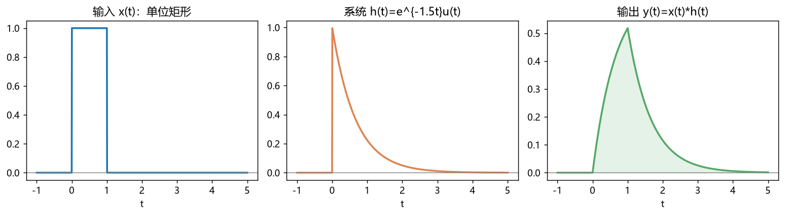
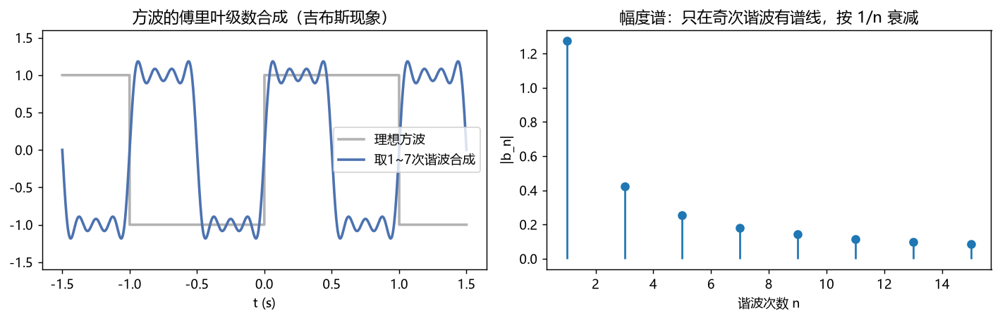
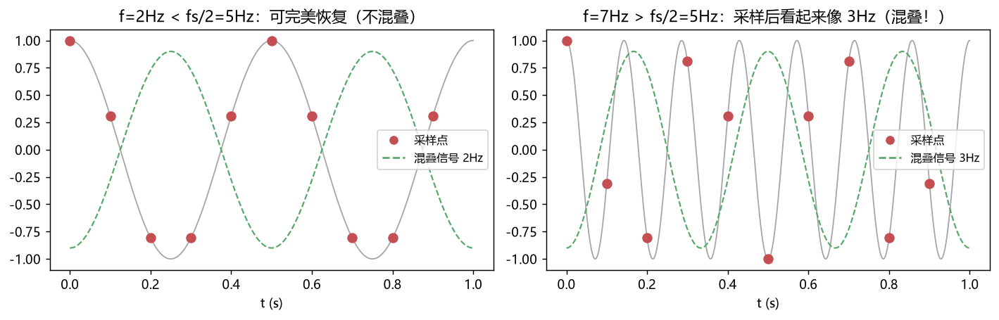

# 05 信号与系统 —— 知识点与例题详解

> 信号与系统是通信工程的"任督二脉"：它教你用**频率**的眼睛看信号，用**卷积**的眼睛看系统。通信原理里 80% 的公式都是从这门课推导出来的。

---

## 一、知识地图

```
信号与系统
├── 信号分类：确定/随机、周期/非周期、能量/功率、连续/离散
├── 系统性质：线性、时不变、因果、稳定（LTI 是主角）
├── 时域分析：卷积 y(t)=x(t)*h(t)、δ(t) 与 u(t)
├── 频域分析：傅里叶级数(周期)、傅里叶变换(非周期)、频谱/带宽
├── 采样定理：f_s ≥ 2f_max —— 模数转换的理论底线
├── 拉普拉斯变换：系统函数 H(s)、极点零点、稳定性
└── z 变换：离散系统的 H(z)、数字滤波器基础
```

---

## 二、信号的分类（先把名词搞懂）

| 分类 | 定义 | 例子 |
|---|---|---|
| 确定性信号 | 可用公式完全确定 | cos(ωt) |
| 随机信号 | 只知统计规律 | 噪声、语音 |
| 能量信号 | 总能量有限、平均功率为0 | 单个脉冲 |
| 功率信号 | 平均功率有限、总能量无限 | 周期信号 |
| 周期信号 | f(t+T)=f(t) | 正弦波 |

### 两个"最重要"的信号

- **单位冲激 δ(t)**：只在 t=0 有值，面积=1。性质：∫f(t)δ(t−t₀)dt = f(t₀)（抽样性质）。
- **单位阶跃 u(t)**：t<0 为 0，t>0 为 1。δ(t) = du/dt。

> **为什么 δ 重要**：给系统输入 δ(t)，输出就是 h(t)（冲激响应）——h(t) 是系统的"DNA"，知道它就能算任意输入的输出。

---

## 三、LTI 系统与卷积

### 3.1 两个判定

- **线性**：齐次性 + 叠加性。a·x₁+b·x₂ → a·y₁+b·y₂。
- **时不变**：输入延迟 τ，输出也只延迟 τ。

### 3.2 卷积（核心中的核心）

$$y(t) = x(t)*h(t) = \int_{-\infty}^{\infty} x(\tau)h(t-\tau)d\tau$$

**图解四步**（对照图04）：① 换元 t→τ；② 翻转 h(−τ)；③ 平移 h(t−τ)；④ 相乘积分。



**必背性质**：
- 交换律：x*h = h*x
- 与冲激：x(t)*δ(t) = x(t)；x(t)*δ(t−t₀) = x(t−t₀)（延迟器！）
- 时域卷积 ⟺ 频域相乘：Y(f) = X(f)·H(f)（**本课第一定理**）

### 例题 1：矩形卷积出三角

**题目**：x(t)=h(t)=宽度1、高度1的矩形脉冲，求 y(t)=x*h。

**详解**：
- 重叠长度在 t∈[0,1] 时从0线性增到1，在 t∈[1,2] 时线性减回0；
- 积分值 = 重叠面积 → **y(t) 是底宽2、高1的三角形**。
- 这个"矩形*矩形=三角"是相关/匹配滤波、雷达脉冲压缩的基石，务必记住形状。

### 例题 2：系统串并联

**题目**：两个子系统 h₁(t)=δ(t)+δ(t−1)，h₂(t)=δ(t−2)。（a）串联？（b）并联？

**详解**：
- 串联 = 卷积：h = h₁*h₂ = δ(t−2)+δ(t−3)（把 h₁ 整体平移2再相加）；
- 并联 = 相加：h = h₁+h₂ = δ(t)+δ(t−1)+δ(t−2)（多径信道建模就这么干！主径+反射径）。

---

## 四、傅里叶分析：信号的"频谱DNA"

### 4.1 傅里叶级数（周期信号）

$$x(t) = a_0 + \sum_{n=1}^{\infty}[a_n\cos(n\omega_0 t) + b_n\sin(n\omega_0 t)], \quad \omega_0=\frac{2\pi}{T}$$

周期信号频谱是**离散谱线**，间隔 ω₀。见方波例子（图02）：只有奇次谐波，幅度 4/(nπ) 递减。



### 例题 3：求周期矩形波带宽

**题目**：周期矩形脉冲占空比 1/10。频谱第一个零点在多少次谐波？

**详解**：单个矩形脉宽 τ 的频谱是 Sa 包络（sinc），第一零点在 f = 1/τ；周期 T=10τ → 谐波间隔 1/T，第一零点恰好在 **10 次谐波**（10×1/T = 1/τ）。能量集中在第一零点内 → 带宽 B ≈ 1/τ。**结论：脉冲越窄，带宽越宽（占空比越小 B 越大）**——这是"速率越高需要带宽越大"的根源。

### 4.2 傅里叶变换（非周期信号）与常用对

$$X(f) = \int x(t)e^{-j2\pi ft}dt, \qquad x(t)=\int X(f)e^{j2\pi ft}df$$

| 时域 | 频域 | 意义 |
|---|---|---|
| δ(t) | 1（均匀谱） | 脉冲越窄频谱越宽 |
| 1（直流） | δ(f) | |
| 矩形脉宽τ | τ·Sa(πfτ) | 主瓣宽 2/τ |
| e^(j2πf₀t) | δ(f−f₀) | 单频线谱 |
| cos(2πf₀t) | ½[δ(f−f₀)+δ(f+f₀)] | 实信号谱共轭对称 |
| e^(−at)u(t) | 1/(a+j2πf) | RC放电 ↔ 低通特性 |

**必背性质**：时移↔相移；**时域压缩↔频域展宽**；卷积定理；帕塞瓦尔定理（时域能量=频域能量）。

### 例题 4：调制的频谱搬移（通信原理的种子）

**题目**：设基带信号 m(t) 频谱为 M(f)，集中于 |f|<4kHz。求 m(t)·cos(2πf_c t) 的频谱（f_c=100kHz）。

**详解**：
1. cos 的频谱是 ±f_c 处两个冲激（各½）；
2. 时域相乘 → 频域卷积：M(f) 被"搬"到 ±f_c 附近；
3. 结果：½M(f−f_c) + ½M(f+f_c)——原谱被搬到 96~104kHz。
> **这就是"调制"的全部数学本质：频谱搬家**。接收端再乘一次 cos 就搬回来（相干解调）。

---

## 五、采样定理（模拟→数字的桥梁）



**奈奎斯特采样定理**：要从抽样信号无失真恢复原信号，必须

$$f_s \ge 2f_{max}$$

- 若 f_s < 2f_max → **混叠**：高频分量伪装成低频（图03右图，7Hz 采样后看着像 3Hz）；
- 恢复方法：抽样后过截止 f_s/2 的理想低通（内插公式恢复）。

### 例题 5：CD 为什么是 44.1kHz

**题目**：人耳听觉上限 20kHz，CD 采样率为何取 44.1kHz 而不是 40kHz？

**详解**：理论下限 2×20=40kHz；但实际低通滤波器不是"砖墙"，需要过渡带（20k~22.05k），再加抗混叠余量 → 44.1kHz。

### 例题 6：欠采样的妙用（考试爱考）

**题目**：带通信号 98~102kHz，采样率必须 ≥204kHz 吗？

**详解**：不必！带通采样定理：只要 f_s ≥ 2×带宽 = 2×4kHz = **8kHz**（且满足 f_s 的整数倍避开信号带），采样后信号的谱会折叠到低频段而不重叠——**软件无线电 SDR 就靠这个技巧用低速 ADC 采高频信号**。

---

## 六、系统函数与稳定性

- **拉普拉斯变换**：把卷积和微分方程变成代数。H(s) = Y(s)/X(s)。
- **稳定性判据**：H(s) 所有极点在左半平面（连续）；H(z) 所有极点在单位圆内（离散）。
- 极点决定"固有响应"的衰减/增长/振荡：负实极点→指数衰减；共轭极点→衰减振荡；右半平面→发散（不稳定）。

### 例题 7：由微分方程求 H(s) 判稳

**题目**：y''(t)+3y'(t)+2y(t)=x'(t)+x(t)，判稳并求冲激响应形状。

**详解**：
1. H(s) = (s+1)/(s²+3s+2) = (s+1)/[(s+1)(s+2)] = 1/(s+2)；
2. 极点 s=−2（左半平面）→ **稳定**；
3. h(t) = e^(−2t)u(t)（指数衰减）。
> 注意 s=−1 处零极点相消——化简后才见真极点。

---

## 七、z 变换与数字系统（通往 DSP）

$$X(z)=\sum_n x[n]z^{-n}$$

- 时移：Z{x[n−1]} = z⁻¹X(z)（"延迟一个采样"就是乘 z⁻¹，数字滤波器的基本砖块）；
- 因果稳定：极点全部在单位圆**内**。

### 例题 8：一阶数字系统

**题目**：y[n] = 0.5y[n−1] + x[n]。求 H(z)、判稳、求 h[n]。

**详解**：
1. H(z) = 1/(1−0.5z⁻¹) = z/(z−0.5)；
2. 极点 z=0.5，|0.5|<1 → 稳定；
3. h[n] = 0.5ⁿ·u[n]（指数衰减）——这就是一个一阶 IIR 低通数字滤波器。

---

## 八、易错点清单

1. 卷积结果的**起点**=两信号起点之和，**宽度**=两信号宽度之和（矩形×矩形=更宽的三角）。
2. 实信号的幅度谱偶对称、相位谱奇对称，负频率是数学存在不是物理存在。
3. "带宽"问的是第一零点、3dB点还是均方根带宽？看清题目定义。
4. 采样定理的 2f_max 只对**低通型**信号直接成立，带通信号用带通采样定理。
5. 判稳定看**极点**，零点可以在任何位置。

---

## 相关章节
- 上一章：[04-数字电子技术](../04-数字电子技术/知识点与例题详解.md)
- 下一章：[06-数字信号处理](../06-数字信号处理/知识点与例题详解.md)
- 调制频谱搬移 → [07-通信原理](../07-通信原理/知识点与例题详解.md)
- 数学基础回炉 → [01-数学基础](../01-数学基础/知识点与例题详解.md)
