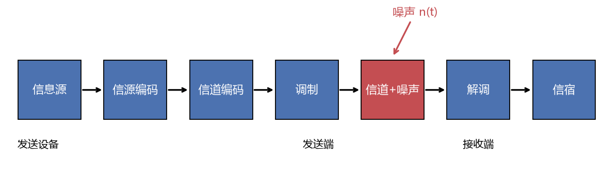
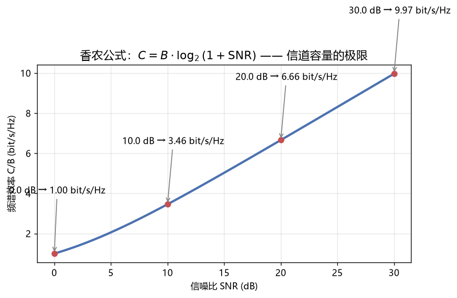
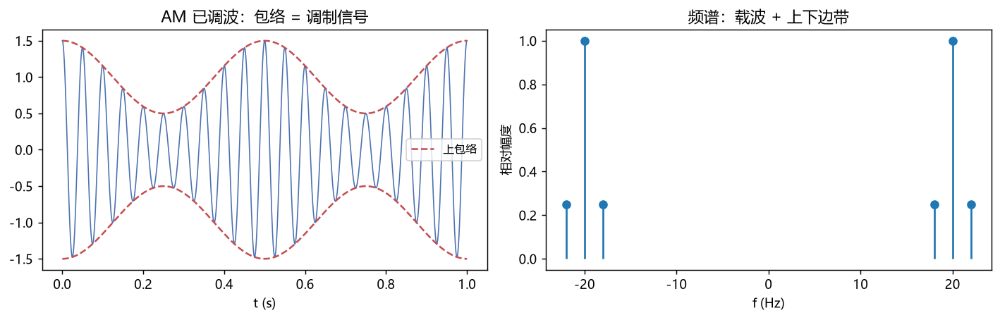
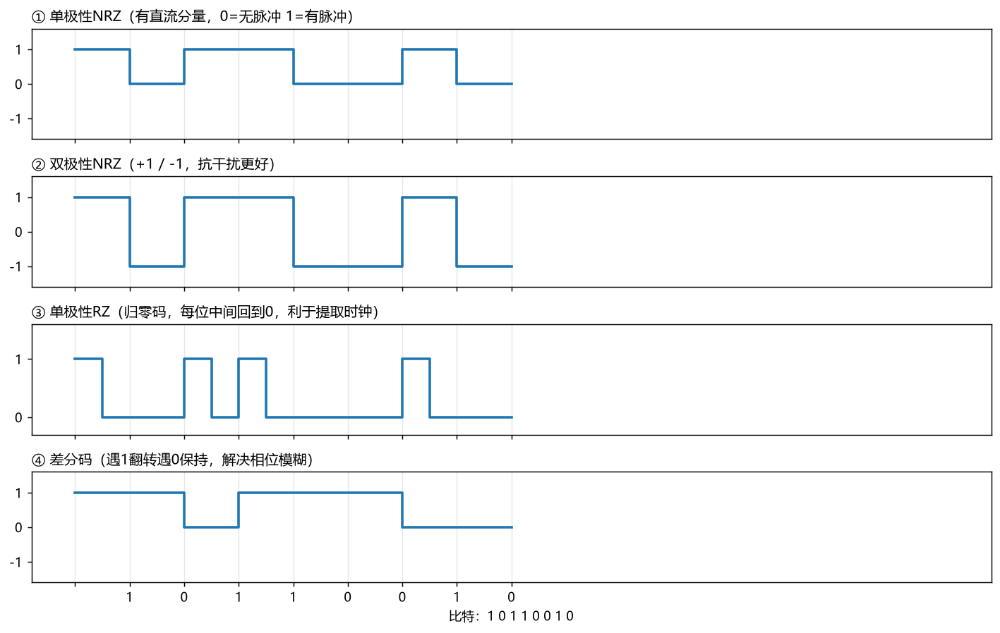
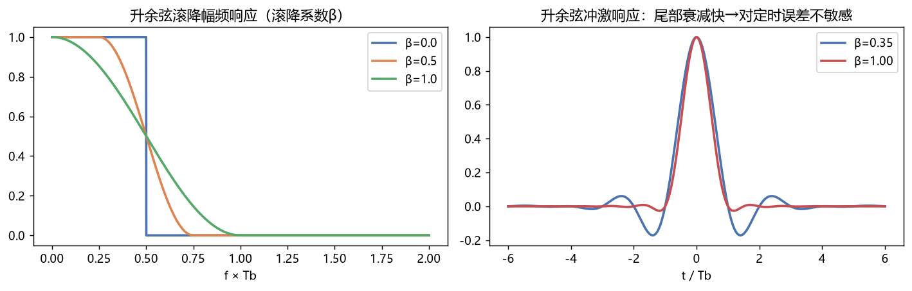
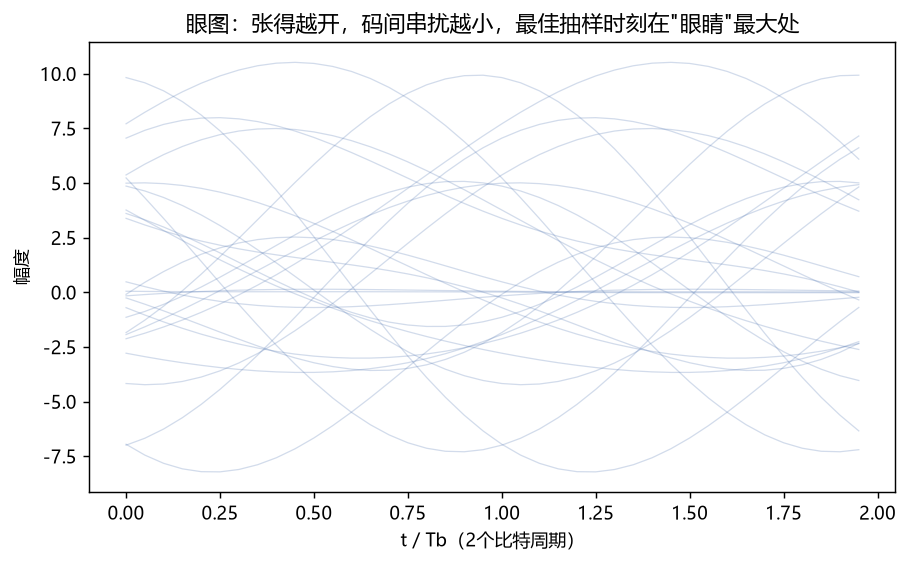
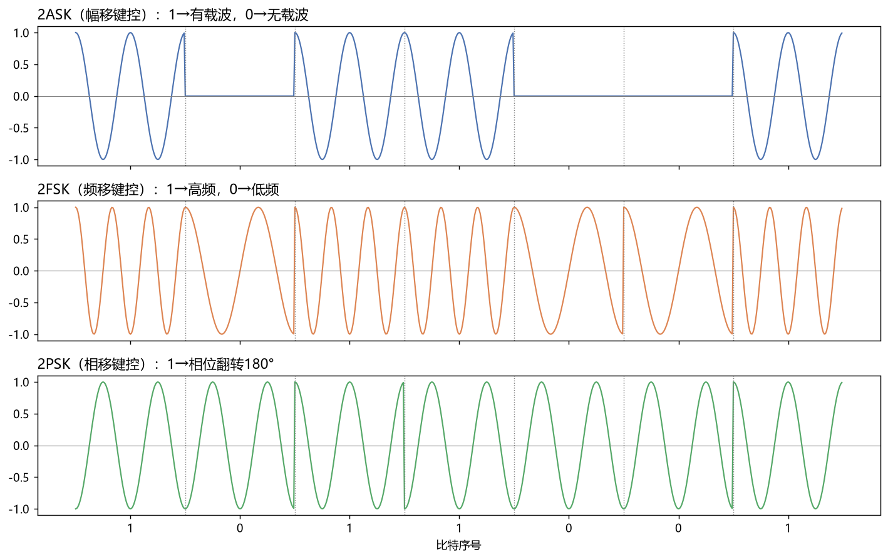
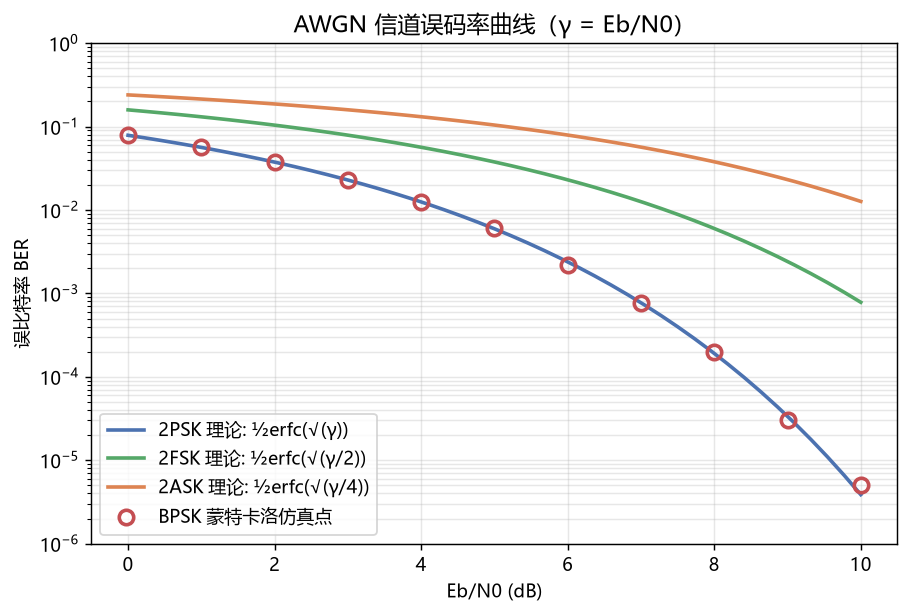
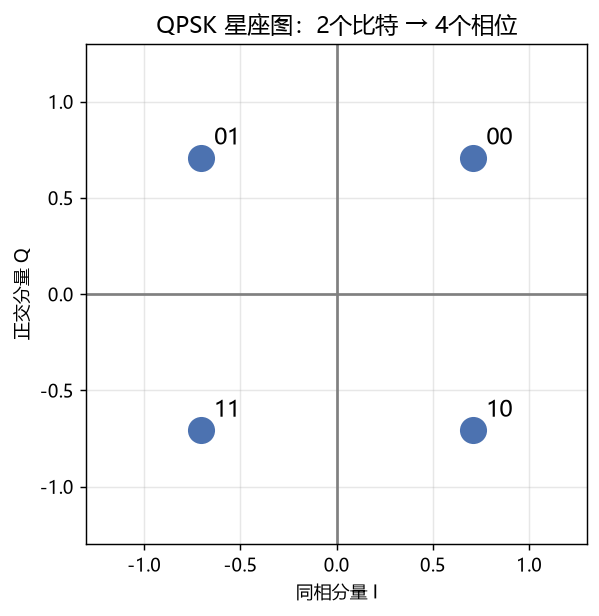
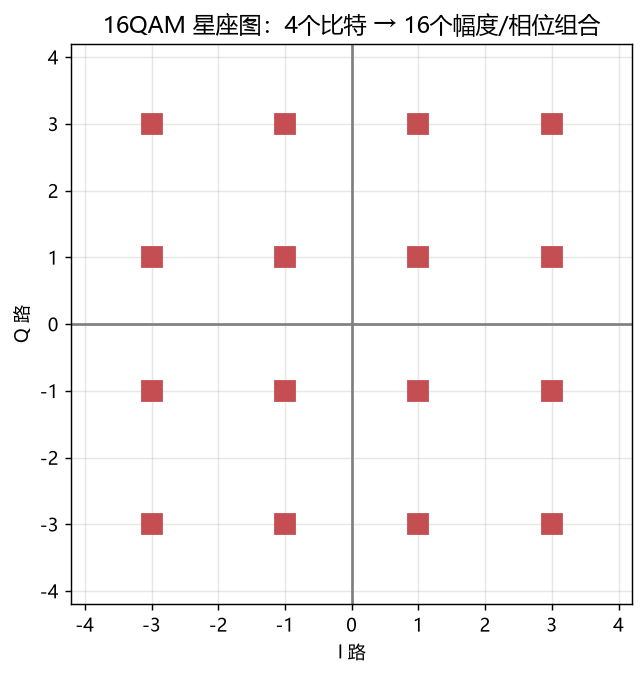

# 07 通信原理 —— 知识点与例题详解（核心主课）

> 通信原理把前面所有课串成一条线：怎么把信息可靠、高效地从 A 送到 B。期末考研专业课之王，毕业论文最大题源。

---

## 一、知识地图（全书脉络）

```
通信原理
├── 1. 通信系统模型：模拟/数字通信系统组成、性能指标
├── 2. 信道与噪声：信道模型、AWGN、香农公式
├── 3. 模拟调制：AM / DSB / SSB / FM（角度调制）
├── 4. 信源数字化：抽样→量化→编码（PCM、ΔM）
├── 5. 数字基带传输：码型、码间串扰、奈奎斯特准则、眼图、升余弦
├── 6. 数字频带传输：2ASK/2FSK/2PSK/QPSK/QAM/MSK
├── 7. 最佳接收：匹配滤波器、相干/非相干
├── 8. 同步：载波同步、位同步、帧同步
├── 9. 信道编码：差错控制、汉明码、线性分组码
└── 10. 复用与多址：FDM/TDM/CDM → FDMA/TDMA/CDMA/OFDMA
```



---

## 二、通信系统模型与性能指标

### 2.1 模型（对照上图）

信源 → 信源编码（去冗余，A/D）→ 信道编码（加冗余纠错）→ 调制 → 信道（+噪声）→ 解调 → 信道译码 → 信源译码 → 信宿。

**为什么要调制？** ①天线尺寸要和波长可比（低频天线大得离谱）；②频分复用让多人同时通信；③把信号搬移到传播特性好的频段。

### 2.2 三大指标

| 指标 | 定义 | 单位 |
|---|---|---|
| 有效性 | 传得快不快：码元速率 R_B、信息速率 R_b | Baud、bit/s |
| 可靠性 | 传得准不准：误码率 Pe、误信率 Pb | 无量纲 |
| 频谱效率 | η = R_b / 带宽 | bit/s/Hz |

**换算**：R_b = R_B · log₂M（M 进制）。二进制时 1 Baud = 1 bit/s。

### 例题 1：速率换算

**题目**：四进制系统码元速率 1200 Baud，信息速率多少？

**详解**：R_b = 1200 × log₂4 = **2400 bit/s**。
（每个四进制符号携带 2 bit——这就是为什么高速系统用高阶调制：同样的波特率传双倍比特。）

---

## 三、信道与噪声、香农公式

**信道分类**：恒参信道（有线、自由空间视距——失真固定可均衡）vs 变参信道（短波电离层、移动信道——多径衰落）。

**噪声**：热噪声（白高斯），AWGN 模型：功率谱 n₀/2 双边均匀。

### 3.1 香农公式（全书最重要的公式）

$$C = B\log_2\left(1+\frac{S}{N}\right) \ \text{bit/s}$$



三条解读：①带宽和信噪比可互换（扩频通信的理论依据）；②带宽无限增大容量趋于 1.44S/n（不能无限白嫖）；③**传信率 R_b ≤ C 才可能无差错传输**。

### 例题 2：香农公式计算

**题目**：电话信道带宽 3.1kHz，信噪比 30dB。最大信息速率？

**详解**：
1. 30dB → S/N = 10³ = 1000；
2. C = 3100×log₂(1001) = 3100×9.97 ≈ **30.9 kbit/s**；
3. 实际调制解调器做到 33.6kbit/s 已经逼近极限（再往上必须压缩/加带宽）。

---

## 四、模拟调制

### 4.1 调幅家族

$$s_{AM}(t)=[A_0+m(t)]\cos\omega_c t$$



| 方式 | 频带 | 特点 |
|---|---|---|
| AM 常规调幅 | 2f_m | 包络检波（收音机便宜）；载波占大半功率，效率低 |
| DSB 双边带 | 2f_m | 去掉载波省功率；必须相干解调 |
| SSB 单边带 | **f_m** | 省一半带宽（短波电台主力）；实现复杂 |
| VSB 残留边带 | ~1.2f_m | 电视图像折中方案 |

### 例题 3：AM 功率分配

**题目**：AM 波 m(t)=A_m·cosω_m t，调幅度 m_a = A_m/A_0 = 0.5。载波功率与边带功率之比？

**详解**：
1. 设载波功率 P_c = A_0²/2，每边带 P_side = (m_aA_0/2)²/2 = m_a²P_c/4；
2. 总边带 = 2×m_a²P_c/4 = m_a²P_c/2 = 0.125P_c；
3. 边带/载波 = **1:8**，即有用信息只占约 11% 功率——这就是要搞 DSB/SSB 的原因。
（AM 最大不失真条件：|m(t)|≤A_0，即 m_a≤1，否则过调制包络检波失真。）

### 4.2 调频 FM（角度调制）

$$s_{FM}(t)=A\cos\left(\omega_c t + K_f\int m(\tau)d\tau\right)$$

- 带宽（卡森公式）：**B ≈ 2(Δf + f_m) = 2(m_f+1)f_m**，m_f=Δf/f_m 为调频指数；
- 特点：**以带宽换信噪比**（宽带 FM 抗噪声能力强，音质好 → 调频广播、模拟对讲、卫星遥测）。

### 例题 4：FM 带宽

**题目**：调频广播最大频偏 75kHz，音频 f_m=15kHz。求带宽。

**详解**：m_f = 75/15 = 5；B = 2(75+15) = **180kHz** → 这就是 FM 电台间隔 200kHz 的由来。

---

## 五、模拟信号数字化（PCM）

**三步曲**：抽样（时间离散，f_s≥2f_max）→ 量化（幅度离散，n bit 分 2ⁿ 级）→ 编码（变 0/1 码流）。

**每路数字电话**：8kHz 抽样 × 8bit 量化 = **64 kbit/s**（一路 PCM 基础信道，欧洲 30/32 路 PCM 一次群 2.048 Mbit/s 的基石）。

### 例题 5：量化噪声

**题目**：满量程 2V，8bit 均匀量化，量化噪声功率？

**详解**：量化间隔 Δ = 2/256 V；量化噪声功率 = Δ²/12 = (7.8mV)²/12 ≈ 5.1×10⁻⁹ W。**量化信噪比 = 6.02n+1.76 ≈ 50dB**。
（语音小信号多、大信号少 → 实用 A 律/μ律**非均匀量化**压扩，小信号给细台阶。）

### 例题 6：增量调制 ΔM

**题目**：ΔM 为什么会斜率过载？怎么办？

**详解**：ΔM 每次只升降一个固定台阶 σ，若信号斜率 > σ·f_s（每秒最多追 f_s·σ）就跟不上 → 斜率失真。对策：提高 f_s 或自适应台阶（ADM）。**ΔM 把量化做到极致：每样值 1 bit。**

---

## 六、数字基带传输

### 6.1 码型（对照图08）



| 码型 | 优点 | 缺点 |
|---|---|---|
| 单极性 NRZ | 简单 | 有直流、无时钟 |
| 双极性 NRZ | 抗干扰好 | 长连0无时钟 |
| RZ 归零 | 含时钟分量 | 带宽加倍 |
| 差分码 | 解决相位模糊 | 一错错俩 |
| AMI/HDB3 | 无直流、可检错 | 需编译码（E 线路标准） |

### 6.2 码间串扰 ISI 与奈奎斯特第一准则

信道带限 → 脉冲拖尾 → 拖尾串进相邻码元抽样时刻 → ISI。

**无 ISI 条件（奈奎斯特第一准则）**：系统整体响应 h(t) 满足

$$h(kT_B)=\begin{cases}1,&k=0\\0,&k\neq 0\end{cases} \quad\Longleftrightarrow\quad \text{等效}H(f)\text{关于} f=\frac{1}{2T_B}\text{奇对称滚降}$$

理想低通带宽 B=1/(2T_B) 时频谱效率极限 **2 Baud/Hz**。但理想低通物理不可实现（拖尾 1/t 衰减慢），用**升余弦滚降**（图13）：



带宽 B = (1+α)/(2T_B)，α 为滚降系数（0~1）。α 大 → 尾部衰减快、对定时误差不敏感，代价是带宽变大。α=1 时 B = 1/T_B。

### 例题 7：升余弦带宽计算

**题目**：R_B = 2000 Baud，α = 0.5。求所需带宽。

**详解**：T_B = 1/2000 s；B = (1+0.5)/(2T_B) = 1.5×1000 = **1500 Hz**。
（注意：频带传输时（调制后）带宽加倍为 2B = 3000Hz。）

### 6.3 眼图（工程仪表盘）



随机码流重叠在同一格：**眼睛张开越大 → ISI 越小、噪声容限越大**；交叉点模糊 = 定时抖动。示波器一搭就能评估基带系统质量。

### 例题 8：部分响应（进阶了解）

**题目**：既想 2 Baud/Hz 又想物理可实现怎么办？

**详解**：**部分响应技术**（如第Ⅰ类相关电平编码）：人为在相邻码元引入已知 ISI（+1, +1 双极性冲激），收端模 2/模 L 判决消除。"鬼畜操作"：利用可控串扰逼近奈奎斯特极限，GSM 的 GMSK 就源自这一思路。

---

## 七、数字频带传输（重点中的重点）

### 7.1 二进制调制（对照图09）



| 方式 | 规则 | 带宽 | 相干解调 BER | 特点 |
|---|---|---|---|---|
| 2ASK/OOK | 1发载波、0不发 | ≈2R_B | Q(√(γ/4))→½erfc(√(γ/4)) | 简单；功率差 |
| 2FSK | 1高频、0低频 | 2Δf+2R_B | ½erfc(√(γ/2)) | 抗衰落好；带宽大 |
| 2PSK | 1相位0、0相位π | 2R_B | **½erfc(√γ)** | 抗噪最好 |
| 2DPSK | 差分编码+2PSK | 2R_B | ½erfc(√γ)·近似 | 解决载波相位 180° 倒π模糊 |

**性能排序（同 Eb/N0）**：2PSK > 2FSK(相干) > 2ASK(相干)。见 BER 曲线（图15）：



### 例题 9：误码率对比（看懂瀑布曲线）

**题目**：要求 BER=10⁻⁵，2PSK 和 2ASK 相干各需多少 Eb/N0？

**详解**：查曲线/反查 erfc 表：
- 2PSK：√γ ≈ 4.27 → γ ≈ 9.4dB；
- 2ASK：需要 √(γ/4) ≈ 4.27 → γ 高 6dB → 约 15.4dB。
**结论**：2ASK 比 2PSK 费 6dB（4 倍功率）——"调制方式的信噪比代价"是论文常客。

### 7.2 四进制与高阶：QPSK / QAM

**QPSK**（对照图10 星座图）：每符号 2 bit，载波 4 个相位（45°/135°/225°/315°）。带宽效率是 2PSK 的 2 倍，抗噪性能与 2PSK 相同（比特级）——**性价比之王**（DVB-S、LTE 控制信道、CDMA 前向）。



**16QAM / 64QAM / 256QAM**（图11）：幅度+相位联合调制，一符号带 4/6/8 bit。频谱效率高但星点挤 → 需要高信噪比（WiFi/5G 自适应调制：信号好自动升 256QAM，差了降到 QPSK）。



### 例题 10：QPSK 实现（串并变换）

**题目**：2400 bit/s 数据做 QPSK，I/Q 各多少速率？码元速率？

**详解**：串并变换拆两路 → I 路和 Q 路各 1200 bit/s；每 2bit 一组 → 码元速率 R_B = 1200 Baud；占用带宽 ≈ 2×1200 = 2400Hz（升余弦α=0 时减半）。
**频谱效率 = 2400/2400 = 1 bit/s/Hz**（α=0 时 2 bit/s/Hz）。

### 例题 11：星座图判距离

**题目**：QPSK 平均能量归一化后星点间最小距离 d 与 2PSK 比？

**详解**：同平均功率下，QPSK 相邻点距比 2PSK 的两电平距小 √2 倍 → 同噪底下**符号**错误率高，但每符号 2 bit，**比特**错误率仍 ≈ 2PSK——"距离决定误码"的直觉要落到比特层面。

### 7.3 MSK/GMSK（现代常用）

MSK：连续相位 FSK，相位路径平滑 → 频谱紧凑；GMSK 再加高斯预滤波（GSM 制式）：占用带宽小、带外辐射低，代价是码间串扰略增。

---

## 八、最佳接收与同步（概念级）

- **匹配滤波器/相关接收**：h(t)=s(T−t)，t=T 抽样判决 → 理论最高 SNR（详见 DSP 例题6）。
- **相干 vs 非相干**：相干（知道载波相位）性能好 1~2dB 但要恢复载波；非相干（包络/差分）简单但差——工程权衡无处不在。
- **同步三部曲**：载波同步（科斯塔斯环）、位同步（锁相环/Gardner）、帧同步（巴克码/独特字检测，对应数电的序列检测器）。

---

## 九、信道编码（纠错码）

### 9.1 三种方式

| 方式 | 能力 | 例子 |
|---|---|---|
| 检错重发 ARQ | 检错+重传 | TCP、蓝牙 |
| 前向纠错 FEC | 收端自行纠错 | 汉明码、卷积码、LDPC、Turbo |
| 混合 HARQ | 纠错+重传结合 | LTE/5G |

### 9.2 线性分组码（汉明码）

**(n,k) 码**：k 位信息 + r=n−k 位监督，纠 1 位错需 2^r ≥ n+1。(7,4) 汉明码：7 位码字、4 位信息，纠 1 错。

**伴随式译码**：S = r·H^T；S=0 无错，S≠0 指示错误图样。

### 例题 12：奇偶校验

**题目**：偶校验 1011001 → 发送码字？

**详解**：数 1 的个数 = 4（偶）→ 校验位补 0 → **10110010**。收端数 1：奇数个则必有错（但不知哪位错，也不能纠）。

### 例题 13：(7,4) 汉明码纠错

**题目**：接收码字 r = 1000101，已知发生 1 位错，监督矩阵标准形式 H=[P|I₃]，伴随式 S = rH^T = 011。哪位错了？

**详解**：
1. 伴随式非零 → 有错；汉明码中伴随式的二进制值直接给出**错误位置**；
2. S = 011 = 3 → 第 3 位错；
3. 纠正：翻转第 3 位 → **1010101**（若第3位原来是0则变为1）。
> 香农信道编码定理保证：R_b < C 时存在码使误码任意小——LDPC/Turbo 码逼近香农限仅差 0.1~1dB（5G 已用）。

---

## 十、复用与多址

| 技术 | 分割维度 | 应用 |
|---|---|---|
| FDM 频分 | 频率 | 广播电台、CATV |
| TDM 时分 | 时间 | PCM 一次群、GSM |
| CDM 码分 | 扩频码 | CDMA(IS-95)、GPS |
| OFDM 正交分 | 相互正交子载波 | WiFi/4G/5G、ADSL |
| WDM 波分 | 光波长 | 光纤骨干（见光纤通信章） |

复用（点到点资源共享）→ 多址（多点接入）：FDMA/TDMA/CDMA/OFDMA/SDMA（波束赋形）。

### 例题 14：TDM 群路计算

**题目**：30 路语音 TDM（每路 64kbit/s）+2 路同步信令，求一次群速率。

**详解**：32 时隙 × 64kbit/s = **2048 kbit/s = 2.048 Mbit/s**（E1 标准，中国/欧洲基群；北美 T1=1.544M）。

---

## 十一、全课程压轴：一个数字通信系统的完整旅程

发"1011" → ①信源编码（已数字化）→ ②信道编码加监督位 → ③串并变换+映射星座点 → ④成形滤波（升余弦）→ ⑤上变频调制载波 → ⑥天线发射 → ⑦信道：衰减+噪声+多径 → ⑧下变频 → ⑨匹配滤波+抽样判决 → ⑩信道译码纠错 → 还原"1011"。
**每一步都是本库对应章节的知识点**——论文仿真就是把这条流水线用代码搭出来。

---

## 十二、易错点清单

1. R_b 与 R_B：多进制别忘了乘 log₂M。
2. 频带（调制后）带宽是基带带宽的 2 倍（双边谱）。
3. 2DPSK 解调有两种（极性比较+码变换 / 差分相干），误码性能略不同，看清题目。
4. 香农公式里的 S/N 是**倍数不是 dB**（先换算！）。
5. 汉明码伴随式给出的是"位置"不是"该改成什么"。
6. 眼图"闭合"原因有两个：ISI 和噪声，先分清。

---

## 相关章节
- 前置：[05-信号与系统](../05-信号与系统/知识点与例题详解.md)、[06-数字信号处理](../06-数字信号处理/知识点与例题详解.md)
- 下一章：[08-电磁场与电磁波](../08-电磁场与电磁波/知识点与例题详解.md)
- 无线工程版 → [11-移动通信](../11-移动通信/知识点与例题详解.md)
- 编码的数学极限 → [10-信息论与编码](../10-信息论与编码/知识点与例题详解.md)
- 毕业实战 → `../../毕业论文/选题与实施指南.md`
