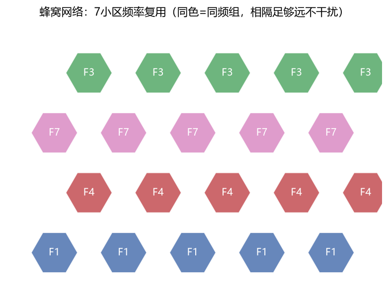
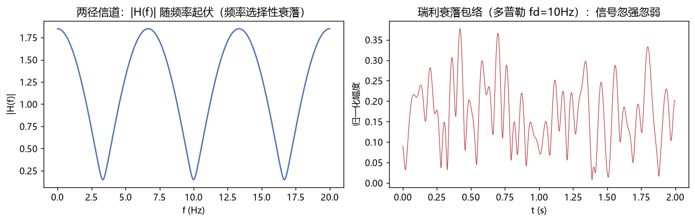

# 11 移动通信 —— 知识点与例题详解

> 从 1G 打电话到 5G 万物互联，移动通信是通信工程最大的就业方向。这门课=通信原理+电磁波+组网思想的综合应用。

---

## 一、知识地图

```
移动通信
├── 蜂窝原理：频率复用、切换、越区
├── 无线信道：大尺度(路径损耗/阴影) + 小尺度(多径衰落/多普勒)
├── 多址方式：FDMA/TDMA/CDMA/OFDMA/SDMA
├── 抗衰落技术：分集、均衡、Rake、交织、MIMO
├── 制式演进：1G→2G(GSM)→3G(CDMA2000/WCDMA/TD)→4G(LTE)→5G(NR)
└── 5G新特性：毫米波、大规模MIMO、网络切片、uRLLC/eMBB/mMTC
```

---

## 二、蜂窝原理（移动通信的第一性原理）



**核心思想**：把地面划成六边形小区，每个小区用一组频率，**隔足够距离的小区复用同一组频率** → 频率资源有限但容量无限扩展。

- **同频复用因子**：如 7 小区一簇（图20，同色同频）；
- **切换 Handover**：移动中信号变弱，网络把你"交接"给更强小区（硬切换先断后接/软切换先接后断——CDMA 特色）；
- **容量提升三板斧**：小区分裂（蜂窝越切越小）、频率复用更紧、更高频谱效率的调制/多址。

### 例题 1：蜂窝容量估算

**题目**：某市面积 1000 km²，每小区覆盖 1 km²，每小区同时支持 50 通话，7 小区复用。全市同时通话数？

**详解**：小区数 = 1000（近似）；每小区 50 路（频率在 7 小区间复用不增加每小区容量）→ **约 5 万路**。若小区分裂到 0.25km² → 20 万路。城市中心基站密如棋盘的原因就在这。

---

## 三、无线信道：信号到手机经历了什么



### 3.1 三层效应叠加

| 尺度 | 现象 | 规律/对策 |
|---|---|---|
| 大尺度 | 路径损耗 | 自由空间∝d²；城市≈d⁻³.⁵（对数距离模型 PL=PL₀+10n·lgd） |
| 中尺度 | 阴影衰落（楼宇遮挡） | 对数正态分布，σ≈8dB；功率控制+余量 |
| 小尺度 | 多径瑞利衰落（图17右） | 深衰可达 −30dB；分集/交织对抗 |

### 3.2 多径的两种后果

- **时延扩展 > 码元周期 → 频率选择性衰落**（某些频率被消掉，图17左）：对策均衡器、OFDM（把宽带切成许多窄带子信道，每个只经历平坦衰落）；
- **多普勒频移**：f_d = v·f_c/c。车速 120km/h @2.6GHz → f_d ≈ 289Hz → 信道时变，交织+信道编码对付时间选择性。

### 例题 2：多普勒计算

**题目**：高铁 350km/h，5G 的 3.5GHz 频段，最大多普勒频移？

**详解**：v = 97.2 m/s；f_d = v·f_c/c = 97.2×3.5×10⁹/3×10⁸ ≈ **1.13kHz**——OFDM 子载波间隔必须够大才扛得住（5G 子载波 30/60kHz 部分为此设计；4G 15kHz 在高铁上勉强）。

---

## 四、多址方式（1G→5G 的"代际密码"）

| 多址 | 分什么 | 制式 | 一句话 |
|---|---|---|---|
| FDMA | 频率 | 1G 模拟 | 各说各的频道 |
| TDMA | 时隙 | 2G GSM | 排班轮流说话 |
| CDMA | 扩频码 | 3G/IS-95 | 同频同时、密码本不同 |
| OFDMA | 时频资源块 | 4G/5G、WiFi | 高速公路划车道网格调度 |
| SDMA | 空间波束 | 5G Massive MIMO | 波束像手电筒照向每个用户 |

### 例题 3：CDMA 容量为什么大？

**题目**：CDMA 所有用户同频，靠什么区分？容量受什么限制？

**详解**：
1. 每用户乘以近似正交的扩频码（沃尔什码/PN 码），接收端用相同码相关解扩，别人变成低电平噪声；
2. 容量受"多址干扰"限制（自干扰系统）：用户越多噪声地板越高；语音激活检测+功率控制可提升 2~3 倍；
3. 处理增益 G = 码片率/比特率（IS-95: 1.2288M/9.6k = 128，21dB）——"用带宽换用户数"。

### 例题 4：OFDM 资源网格（4G/5G 物理）

**题目**：LTE 20MHz 带宽，子载波间隔 15kHz，FFT 2048 点。可用子载波约多少？资源块 RB？

**详解**：
1. 20MHz/15kHz ≈ 1333 个，扣除保护带留 **1200** 个；
2. 1 RB = 12 子载波×0.5ms → 共 **100 RB**；调度器每毫秒给不同用户分配 RB → 高效"车道级"复用。

---

## 五、抗衰落四件套

1. **分集**：多条独立路径取合并（空间分集多天线、频率分集跳频/宽带、时间分集交织+重传、极化分集）——"别把鸡蛋放一条径"；
2. **均衡**：自适应逆滤波抵消信道失真（时域均衡/频域均衡）；
3. **信道编码+交织**：把突发错打散成随机错再纠（对照信息论例题9）；
4. **Rake 接收机**（CDMA）：多径"变废为宝"，每条径一个相关器再最大比合并。

### 例题 5：分集增益估算

**题目**：两支路最大比合并 MRC，每支路平均 SNR 10dB 瑞利衰落。深衰落中断概率（瞬时SNR<0dB）从多少降到多少？

**详解**：
1. 单支路：P = P(γ<0dB) = 1−e^(−1/10) ≈ 9.5%；
2. 两独立支路 MRC：P ≈ 1−e^(−0.1)(1+0.1) ≈ 0.9%（γ合成是 2 自由度卡方分布）；
3. **中断概率降约 10 倍**——MIMO/分集是现代无线可靠性的基石。

---

## 六、5G 三大场景与关键技术

- **eMBB**（增强移动宽带）：毫米波 24~52GHz、256QAM、大规模 MIMO 64T64R 波束赋形；
- **uRLLC**（超可靠低时延）：空口时延 1ms（车联网/远程手术）→ 短时隙、免调度、边缘计算；
- **mMTC**（海量连接）：10⁶ 设备/km²（物联网）→ NB-IoT、非正交接入。

**毫米波**：带宽 400MHz+ 但路损大、穿墙差（对照电磁波例：3.5GHz λ≈8.6cm，28GHz λ≈1.07cm）→ 基站更密 + 波束赋形补增益。

### 例题 6：波束赋形增益

**题目**：64 阵元均匀线阵，波束赋形最大增益？

**详解**：阵列增益 ≈ 10lgN = 10lg64 ≈ **18dBi**（加上能量集中波束窄，等效覆盖距离翻倍以上）——5G 用毫米波还能活的物理底气。

---

## 七、易错点清单

1. 路径损耗指数 n：自由空间 2，城市常取 3~4，别死记 2。
2. 瑞利衰落是"无直射径"，有直射径（莱斯分布）衰落轻得多——基站视距与否差别巨大。
3. 切换由**网络侧测量报告**触发，不是手机单方面决定。
4. OFDM 循环前缀 CP 对抗多径，子载波间隔对抗多普勒——方向别搞反。
5. MIMO 空间复用的容量提升依赖"信道秩"，散射丰富的环境才有高分集/复用增益。

---

## 相关章节
- 上一章：[10-信息论与编码](../10-信息论与编码/知识点与例题详解.md)
- 下一章：[12-光纤通信](../12-光纤通信/知识点与例题详解.md)
- 调制与BER → [07-通信原理](../07-通信原理/知识点与例题详解.md)
- 电磁波传播 → [08-电磁场与电磁波](../08-电磁场与电磁波/知识点与例题详解.md)
