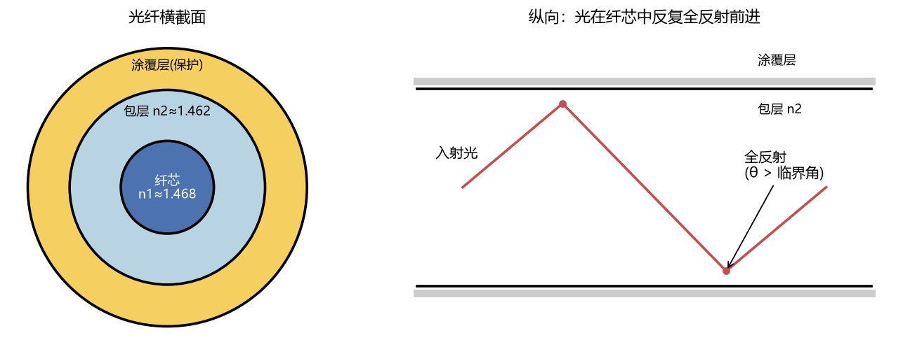

# 光纤通信

> 科目：通信工程 ｜ 收录日期：2026-08-17 ｜ 来源：知识123/通信工程知识库

> 全球 99% 的跨洋数据走海底光缆。光纤通信=通信原理+光学：带宽近乎无限、不受电磁干扰。

---

## 一、知识地图

```
光纤通信
├── 光纤原理：全反射、数值孔径、阶跃/渐变、单模/多模
├── 损耗与色散：衰减谱(1550nm窗口)、色度色散/模间色散/PMD
├── 光器件：光源(LED/LD)、探测器(PIN/APD)、光放大器(EDFA)
├── 系统组成：光发射机→光纤→中继/放大→光接收机
├── 复用技术：WDM/WDM-C/DWDM
└── 网络与前沿：SDH/OTN、PON(光纤到户)、相干光通信、空分复用
```

---

## 二、光纤是怎么"导光"的



三层结构（对照图19）：纤芯(n₁) + 包层(n₂<n₁) + 涂覆层。光以大于临界角射到芯包界面就**全反射**，被锁在纤芯中 zigzag 前进。

- **临界角**：θ_c = arcsin(n₂/n₁)（例题见电磁场例2）；
- **数值孔径** NA = √(n₁²−n₂²)：收光能力，NA 越大越易耦合但色散越大。

### 光纤分类（必考）

| 类型 | 芯径 | 传播模式 | 应用 |
|---|---|---|---|
| 多模阶跃 SI | 50/62.5μm | 多条路径 | 短距（楼内布线） |
| 多模渐变 GI | 50μm | 折射率渐变使各路径时延趋同 | 千兆局域网 |
| **单模 SM** | **~9μm** | 只有 1 个模式 | **长途骨干、5G前传** |

### 例题 1：为什么长途用单模？

**题目**：多模光纤模间色散约 20 ns/km，单模几乎为 0。1 Gbit/s 信号最多传多远（不严重展宽）？

**详解**：
1. 1Gbit/s 码元宽 1ns；若允许展宽 ~10% 码元宽度(0.1ns/km×L)：
2. 多模：0.1ns/(20ns/km) → **仅几米到几十米就需均衡**（实际用 GI 光纤降到 ~0.2ns/km，几百米~2km）；
3. 单模无模间色散 → 色度色散 ~17ps/(nm·km)，可传几十公里。
> 这就是数据中心用多模（便宜、好接）、长途用单模（性能）的原因。

---

## 三、损耗与色散（两大"距离杀手"）

### 3.1 损耗谱

衰减 α = −10·lg(P_out/P_in)/L (dB/km)。

- **1310nm**：色散零点，损耗 ~0.35 dB/km；
- **1550nm**：损耗最低点 ~0.2 dB/km（石英红外本征吸收极限）→ 长途首选；
- 1380nm 附近 OH⁻ 离子"水峰"（现代低水峰光纤已抹平）。

### 例题 2：链路损耗预算（工程必考）

**题目**：1550nm 系统：发 0 dBm，光纤 80km×0.2dB/km，熔接 10 个×0.05dB，连接器 2 个×0.5dB，收机灵敏度 −28 dBm。链路能通吗？

**详解**（全部 dB 加减）：
1. 光纤 16dB + 熔接 0.5dB + 连接器 1dB = 总损 17.5dB；
2. 收光 = 0 − 17.5 = **−17.5 dBm** ≥ −28 dBm；
3. 余量 10.5dB（工程一般要求 ≥3dB）→ **通，且很健康**。

### 3.2 色散（脉冲展宽→码间串扰）

| 类型 | 机理 | 影响对象 |
|---|---|---|
| 模间色散 | 各模式路径长短不同 | 多模光纤 |
| 色度色散 | 不同波长速度不同（材料+波导） | 单模高速系统 |
| PMD 偏振模色散 | 两偏振态速度差 | >10Gbit/s 超长距 |

### 例题 3：色散限制距离

**题目**：10Gbit/s 直接调制，色度色散 17 ps/(nm·km)，光源谱宽 0.1nm。最大距离经验公式 B²·D·Δλ·L ≈ 104000 (Gbit/s)²·ps/nm/km... 用 L_max ≈ 104000/(B²·D·Δλ)。

**详解**：L ≈ 104000/(10²×17×0.1) ≈ **61 km**；要更远？色散补偿光纤(DCF)反向色散抵消、或相干接收+电域均衡（现代 400G 全靠它）。

---

## 四、光器件

| 器件 | 原理 | 关键指标 |
|---|---|---|
| LED | 自发辐射 | 便宜、慢(<1G)、谱宽 |
| **LD 激光器** | 受激辐射+谐振腔 | 窄谱、快、长寿命 |
| PIN | 光生载流子 | 简单，灵敏度一般 |
| **APD** | 载流子倍增 | 增益10~100，需高压 |
| **EDFA** | 铒离子受激放大 1550nm | 全光放大，不用光电转换！ |

### 例题 4：EDFA 为什么伟大？

**题目**：无中继传输 vs EDFA 放大，跨洋 10000km 会怎样？

**详解**：
1. 纯光纤 10000km×0.2dB/km = 2000dB 损耗 → 信号剩 10⁻²⁰⁰，彻底没了；
2. 传统中继每 80km 做光→电→光再生（昂贵、速率锁定）；
3. EDFA 每 80km 全光放大 ~20dB，且**与速率/格式无关**——一根海缆 WDM 几十波一起放大 → 90年代后海缆容量爆炸的功臣。

---

## 五、WDM 波分复用（一根光纤当几十根用）

多个波长（信道）间隔刚性排布共用一根纤：粗波分 CWDM（20nm 间隔，~18 波，城域）与密集波分 **DWDM**（0.8/0.4nm 间隔，80~160 波，骨干）。

### 例题 5：DWDM 容量计算

**题目**：96 波 × 每波 400Gbit/s 的系统总容量？

**详解**：96×400G = **38.4 Tbit/s**（一根光纤！）。对比：5G 基站回传单站 ~1Gbit/s 量级 → 一根纤喂饱数万个基站的需求。C+L 波段扩展后实验室已超 100Tbit/s。

---

## 六、接入网：光纤到户 FTTH（PON）

无源光网络：局端 OLT —无源分光器— 用户 ONU，分光比 1:32/1:64。

- **EPON/GPON**：1G/2.5G 下行广播+上行 TDMA；
- **10G-PON（XG(S)-PON）**：当前 FTTH 主力；
- 波长规划：上行 1310nm / 下行 1490nm（语音/视频 1550 另行）——单纤双向。

### 例题 6：PON 光功率预算

**题目**：GPON OLT 发 +2dBm(1490nm)，1:64 分光器插损 ~18dB（含不均匀），光纤 20km×0.35dB/km(1310nm取0.35)，ONU 灵敏度 −27dBm。预算够吗？

**详解**：总损 = 18 + 7 = 25dB；收光 = 2−25 = −23dBm ≥ −27dBm → 余量 4dB → **够用**（Class B+ 等级设计如此）。

---

## 七、易错点清单

1. 单模/多模看的是"模式数"（芯径 vs 波长关系 V<2.405 才单模），不是"几根纤"。
2. 损耗单位 dB/km：1550nm 0.2dB/km 不是"每公里剩 20%"。
3. EDFA 放大 1550nm 窗口，1310nm 不能用（那是半导体光放大 SOA 的事）。
4. WDM 中"波"与"频"等价：100GHz 间隔 ≈ 0.8nm@1550nm。
5. 光功率预算里**熔接点、连接器、分光器**都要算，别只算光纤。

---

## 相关章节
- 上一章：[11-移动通信](../11-移动通信/知识点与例题详解.md)
- 下一章：[13-计算机网络](../13-计算机网络/知识点与例题详解.md)
- 全反射物理 → [08-电磁场与电磁波](../08-电磁场与电磁波/知识点与例题详解.md)
- WDM 与复用家族 → [07-通信原理](../07-通信原理/知识点与例题详解.md)

## 相关笔记

- [[通信工程总索引]]
- [[电磁场与电磁波]]
