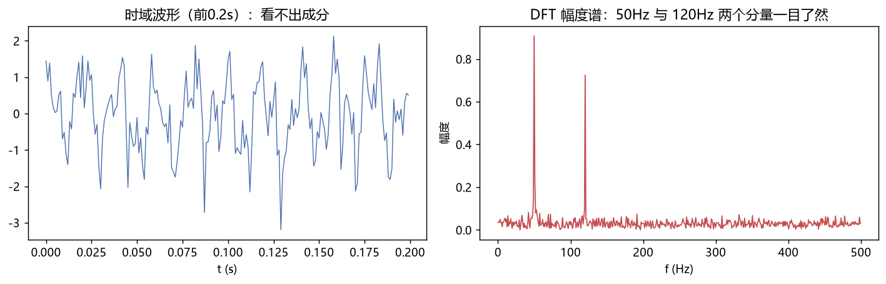

# 数字信号处理

> 科目：通信工程 ｜ 收录日期：2026-08-17 ｜ 来源：知识123/通信工程知识库

> DSP 是"用代码处理信号"：手机降噪、语音识别前端、5G 基带全是 DSP。它是信号与系统在计算机上的实现。

---

## 一、知识地图

```
数字信号处理
├── A/D与D/A：抽样、量化、编码
├── 离散系统：差分方程、h[n]、FIR/IIR
├── DFT/FFT：频谱分析的核心工具
│   ├── 频率分辨率、栅栏效应
│   └── 频谱泄漏与窗函数
├── 数字滤波器
│   ├── FIR：线性相位、绝对稳定、窗函数法设计
│   └── IIR：阶数低效率高、巴特沃斯/切比雪夫
└── 应用：频谱仪、均衡、 OFDM 调制解调(FFT实现)
```

---

## 二、从模拟到数字

**处理流程**：抗混叠低通滤波 → 抽样（f_s ≥ 2f_max）→ 量化（n bit，每bit换 6dB 信噪比）→ 数字处理 → D/A → 平滑滤波。

### 例题 1：系统类型判断

**题目**：y[n] = 0.25(x[n]+x[n−1]+x[n−2]+x[n−3]) 是什么？

**详解**：
- 输出只与输入有关（无反馈）→ **FIR**（有限冲激响应）；
- 物理意义：连续 4 点滑动平均——最简单的**低通滤波器**（去高频抖动）；
- 阶数 3，长度 4。做心电图工频抑制、股价平滑都是它。

---

## 三、DFT：数字频谱仪的引擎

### 3.1 定义

$$X[k]=\sum_{n=0}^{N-1}x[n]e^{-j2\pi kn/N}, \quad k=0,1,\dots,N-1$$

N 点 DFT 把信号映射到 N 个频率点：f_k = k·f_s/N，**频率分辨率 Δf = f_s/N**。

FFT 是 DFT 的快速算法：乘法量从 N² 降到 (N/2)log₂N——N=1024 时快约 200 倍。**现代通信（OFDM）没有 FFT 就不存在。**



### 例题 2：读懂频谱图（对照图06）

**题目**：f_s=1kHz，N=1024，信号含 50Hz 和 120Hz 两个正弦。谱峰出现在哪两个 k 上？分辨率多少？

**详解**：
1. Δf = 1000/1024 ≈ 0.977Hz；
2. k = 50/0.977 ≈ 51.2 → **k≈51**；k = 120/0.977 ≈ 122.9 → **k≈123**；
3. 因为 50Hz 不是 Δf 的整数倍，能量会"泄漏"到相邻 k——这就是**栅栏效应/频谱泄漏**。

### 例题 3：怎么提高分辨率？

**题目**：要分辨相距 1Hz 的两个音，f_s=1kHz，至少采多少点？

**详解**：Δf = f_s/N ≤ 1Hz → N ≥ 1000 → 至少 **1000 点（即1秒数据）**。
**关键认知**：频率分辨率由**采样时间长度 T=N/f_s 决定**，不是由采样率决定——想要更细的谱，必须采更久。

### 3.2 频谱泄漏与窗函数

截断信号 = 时域乘矩形窗 = 频域卷积 Sa 函数 → 谱线两侧出现旁瓣。

| 窗 | 旁瓣 | 主瓣 | 适用 |
|---|---|---|---|
| 矩形窗 | −13dB（差） | 最窄 | 分辨率优先 |
| 汉宁窗 | −31dB | 变宽 2 倍 | 抑制泄漏 |
| 汉明窗 | −41dB | 变宽 2 倍 | 语音处理常用 |

> **选窗口诀**：要看清挨得近的频率 → 矩形窗（主瓣窄）；要压住小信号被大信号旁瓣淹没 → 汉宁/布莱克曼窗。

---

## 四、数字滤波器设计

### 4.1 FIR vs IIR（必考对比）

| | FIR | IIR |
|---|---|---|
| 结构 | 只有前馈（卷积和） | 有反馈（差分方程递归） |
| 稳定性 | **绝对稳定** | 可能不稳定（要检查极点） |
| 线性相位 | **可以做到**（对称系数） | 难 |
| 阶数 | 高 | 低（效率高） |
| 典型设计法 | 窗函数法、频率采样 | 巴特沃斯/切比雪夫原型+双线性变换 |

> **通信选型**：数字通信（如匹配滤波、成型滤波）必须线性相位 → 选 FIR；音频均衡等实时性苛刻场合可用 IIR。

### 例题 4：FIR 窗函数法设计步骤（完整流程）

**题目**：设计 33 阶 FIR 低通，截止 0.25π，用汉明窗。

**详解**（五步，可直接照做）：
1. **理想频响** → 理想冲激响应：h_d[n] = sin(ω_c(n−M/2))/(π(n−M/2))，M=32，ω_c=0.25π；
2. **加窗**：h[n] = h_d[n]·w[n]，w[n]=0.54−0.46cos(2πn/M)（汉明窗）；
3. 验证**线性相位**：检查 h[n] 满足 h[n]=h[M−n]（对称）✓；
4. 用 FFT 求 |H(e^jω)| 看通带阻带是否达标；
5. 落地实现：y[n] = Σ h[k]x[n−k]（MATLAB/Python 一行卷积）。

### 例题 5：一阶 IIR 高低通判别

**题目**：y[n] = a·y[n−1] + (1−a)·x[n]，a=0.9。这是什么滤波器？

**详解**：
- H(z) = (1−a)/(1−az⁻¹)，极点 z=0.9（单位圆内，稳定）；
- z=1（直流）：H = (1−a)/(1−a) = 1（放行）；z=−1（高频）：H = 0.1/1.9 ≈ 0.053（压制）；
- → **低通**。指数加权滑动平均，单片机里 3 行代码实现传感器平滑，工程界俗称"一阶互补滤波"。

### 例题 6：匹配滤波器（通信收端的核心）

**题目**：发送脉冲 s(t)，AWGN 信道，最佳接收滤波器是什么？

**详解**：h(t) = k·s(T−t)（发送波形的**翻转平移**），在 t=T 时刻输出信噪比最大（∝ 信号能量E）。
- 频域：H(f) = k·S*(f)e^(−j2πfT)；
- 用相关器实现：r(T) = ∫r(t)s(t)dt。
> 2PSK 相干接收、雷达脉冲压缩、CDMA RAKE 接收机全是匹配滤波思想——**"卷积反转"在这里变成了工程现实**。

---

## 五、FFT 在现代通信中的位置

- **OFDM**：N 路子载波调制 = 一次 IFFT；解调 = FFT（4G/5G/WiFi 物理层的心脏，对照图18）。
- **信道估计/均衡**：发已知导频 → 接收做 FFT → 除法均衡。
- **频谱感知**：认知无线电扫描频段占用。

### 例题 7：OFDM 为什么用 FFT？

**题目**：1024 子载波的 OFDM 符号，直接实现和 FFT 实现的复乘次数对比？

**详解**：
- 直接 DFT：N² = 1024² ≈ 10⁶ 次复乘；
- FFT：(N/2)log₂N = 512×10 = 5120 次 → 快约 **200 倍**。
> 这就是 1970 年代 FFT 成熟后 OFDM 才走向实用（DSL→WiFi→LTE）的原因。

---

## 六、易错点清单

1. DFT 的 k 是"频点序号"，真实频率 = k·f_s/N，别把 k 当 Hz。
2. 补零**不能**提高物理分辨率（只做插值），只有加长采样时间才能。
3. FIR 对称系数才线性相位，随手设计不对称系数就没有线性相位。
4. 双线性变换设计 IIR 有频率畸变，截止频率要预畸（pre-warping）。
5. 量化位数影响的是"信噪比"，采样率影响的是"可分析带宽"，两者别混。

---

## 相关章节
- 上一章：[05-信号与系统](../05-信号与系统/知识点与例题详解.md)
- 下一章：[07-通信原理](../07-通信原理/知识点与例题详解.md)
- 滤波器电路版 → [02-电路分析](../02-电路分析/知识点与例题详解.md)
- OFDM 应用 → [11-移动通信](../11-移动通信/知识点与例题详解.md)

## 相关笔记

- [[通信工程总索引]]
- [[信号与系统]]
- [[通信原理]]
