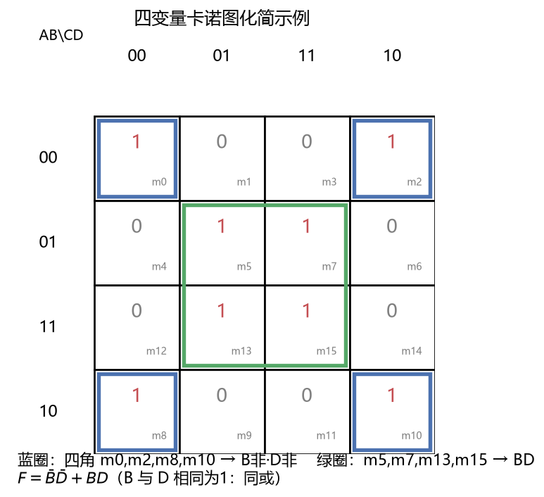

# 数字电子技术

> 科目：通信工程 ｜ 收录日期：2026-08-17 ｜ 来源：知识123/通信工程知识库

> 数电是"0和1的世界"：CPU、存储器、通信编解码器全是数字电路。通信工程的本色就是"把一切数字化"。

---

## 一、知识地图

```
数字电子技术
├── 数制与编码：二进制/十六进制/BCD/格雷码
├── 逻辑代数：基本定律、摩根定理、卡诺图化简
├── 门电路：与或非、异或、OC门/TTL/CMOS
├── 组合逻辑：译码器、数据选择器、加法器、比较器
├── 触发器：RS/D/JK/T —— 记住1位
├── 时序逻辑：寄存器、计数器、状态机
└── ADC/DAC：模拟与数字的桥梁（抽样量化）
```

---

## 二、数制转换（必须秒杀）

### 2.1 方法

- **其他进制 → 十进制**：按权展开。(1011)₂ = 8+0+2+1 = 11
- **十进制 → 二进制**：整数部分除2取余（倒写），小数部分乘2取整。
- **二进制 ↔ 十六进制**：4位一组互换。(1011 0110)₂ = (B6)₁₆

### 例题 1：综合转换

**题目**：把 (45.25)₁₀ 转成二进制。

**详解**：
1. 整数 45：45/2→余1, 22/2→余0, 11/2→余1, 5/2→余1, 2/2→余0, 1/2→余1 → (101101)₂
2. 小数 0.25：0.25×2=0.5 取0；0.5×2=1.0 取1 → (0.01)₂
3. 结果：**(101101.01)₂**。验证：32+8+4+1+0.25 = 45.25 ✓

### 例题 2：通信里的 BCD 与格雷码

**题目**：为什么旋转编码器用格雷码？

**详解**：格雷码相邻码字只变 1 位（000→001→011→010…）。普通二进制 011→100 时三位同时变化，若读数瞬间错位会读出 010/101 等乱码；格雷码最多错 1 位计数。QPSK 星座点用格雷码标注也是同理：噪声导致判错时，多半只错 1 个比特（对比图10）。

---

## 三、逻辑代数与化简

### 3.1 必背定律

| 定律 | 公式 |
|---|---|
| 摩根定理 | \overline{A·B} = \bar{A}+\bar{B}；\overline{A+B} = \bar{A}·\bar{B} |
| 分配律 | A(B+C) = AB+AC；A+BC = (A+B)(A+C) |
| 吸收律 | A+AB = A；A+\bar{A}B = A+B |
| 异或 | A⊕B = \bar{A}B + A\bar{B}；A⊕A=0, A⊕0=A |

### 例题 3：公式化简

**题目**：化简 F = AB + A\bar{B} + \bar{A}C。

**详解**：AB + A\bar{B} = A(B+\bar{B}) = A → F = A + \bar{A}C = **A + C**（吸收律）。

### 3.2 卡诺图化简（数电第一大题）



**步骤**：① 按格雷码排列行列；② 填 1；③ 圈"2 的整数次幂"个相邻 1（可环绕边角）；④ 每圈保留取值不变的变量，相加。

### 例题 4：四变量卡诺图（对照上图24）

**题目**：F(A,B,C,D) = Σm(0,2,5,7,8,10,13,15)，化简。

**详解**：
1. 四角 m0,m2,m8,m10 组成一大圈：变量 B=0、D=0 不变 → **B̄·D̄**；
2. 中央 m5,m7,m13,m15 组成一圈：B=1、D=1 不变 → **B·D**；
3. F = B̄D̄ + BD = B⊙D（同或）。
> 圈越大，消去的变量越多，表达式越简——这是硬件省门电路的钱！

---

## 四、组合逻辑器件

| 器件 | 功能 | 通信应用 |
|---|---|---|
| 译码器 74138 | 3位二进制 → 8选1输出 | 地址译码、指令译码 |
| 数据选择器 MUX | 多选一开关（地址选择） | 时分复用 TDM 的开关！ |
| 加法器 | 半加/全加 | CRC、纠错码计算 |
| 比较器 | 两数比大小 | 门限判决（数字检波） |

### 例题 5：用译码器实现函数

**题目**：用 3-8 译码器实现 F = Σm(1,2,4,7)。

**详解**：译码器各输出对应一个最小项的非（低有效），把它们接与非门：
F = \overline{\overline{m1}·\overline{m2}·\overline{m4}·\overline{m7}} = m1+m2+m4+m7 ✓。
**思想**：译码器 = "最小项发生器"，任何组合逻辑都能这样拼。

---

## 五、触发器与时序电路

### 5.1 四种触发器（记住"时钟来了干什么"）

| 触发器 | 特性方程 | 一句话 |
|---|---|---|
| D | Qⁿ⁺¹ = D | 直通：来一个时钟，存一位 |
| JK | Qⁿ⁺¹ = J\bar{Q} + \bar{K}Q | 全能：J=K=0保持，J=K=1翻转 |
| T | Qⁿ⁺¹ = T⊕Q | T=1翻转，T=0保持 |
| RS | 约束 R·S=0 | 基础（不允许同时为1） |

### 5.2 计数器

- n 个触发器最多计 2ⁿ 个状态（模 2ⁿ）；
- 74LS161 是 4 位二进制同步计数器 → 通信中的**分频器**：输出发位时钟、码元同步。

### 例题 6：异步二进制计数器

**题目**：3 级 D 触发器（每级 Q̄ 接回 D）级联，输入 f=8kHz。求最终输出频率。

**详解**：每级二分频 → 8k/2/2/2 = **1kHz**，占空比 50%。
> 位同步时钟、波特率发生器就是这个原理：主时钟 16MHz 经分频得 9600Hz 的串口波特率。

### 例题 7：序列检测器（状态机设计三步法）

**题目**：检测串行输入中的"101"。

**详解**：
1. **定状态**：S0(没检测到)、S1(检测到1)、S2(检测到10)、S3(检测到101,输出1)；
2. **列状态表**：S0+输入1→S1；S1+0→S2；S2+1→S3(输出1)；S2+0→S0；S3+1→S1（尾部1可复用），S3+0→S2；
3. **编码实现**：2 位二进制编码 → 两个 D 触发器 + 组合逻辑。
> 通信接收端的"帧头检测"（如检测 0x7E 起始标志）就是序列检测器的工程版。

---

## 六、ADC / DAC（模数桥梁，通信承上启下）

- **ADC 三步**：抽样（见信号与系统图03）→ 量化（幅度离散化）→ 编码（变成二进制）。
- **量化误差**：±Δ/2，Δ = 满量程/2ⁿ；**n 每加 1 位，信噪比提高 6dB**（SQNR ≈ 6.02n + 1.76 dB）。
- 常见结构：逐次逼近型（SAR，中等速度高精度，万用表/传感器主流）、并行比较型（最快）、Σ-Δ型（音频高精度）。

### 例题 8：量化信噪比

**题目**：CD 音质 16bit 量化，理论信噪比多少？

**详解**：SQNR ≈ 6.02×16 + 1.76 ≈ **98dB**（人耳动态范围约 120dB，所以 Hi-Res 推 24bit）。

### 例题 9：奈奎斯特与 ADC

**题目**：语音信号 300~3400Hz，ADC 抽样率至少多少？

**详解**：f_s ≥ 2×f_max = 2×3400 = 6800Hz；工程留余量取 **8kHz**（这就是电话 PCM 标准的由来！后面通信原理会反复见到 8kHz）。

---

## 七、易错点清单

1. 卡诺图行列必须按**格雷码**排（00-01-11-10），按二进制排会圈错。
2. 圈只能圈 2ⁿ 个 1，且尽量大、圈数尽量少；所有 1 至少被圈一次。
3. 触发器的动作发生在**时钟边沿**（上升/下降沿触发），不是电平（边沿触发型）。
4. 异步计数器有累积延迟，高速场合用同步计数器。
5. ADC 位数的"6dB 规则"别和放大器增益 dB 搞混。

---

## 相关章节
- 上一章：[03-模拟电子技术](../03-模拟电子技术/知识点与例题详解.md)
- 下一章：[05-信号与系统](../05-信号与系统/知识点与例题详解.md)
- 抽样定理深入 → [05-信号与系统](../05-信号与系统/知识点与例题详解.md)
- 编码 → [07-通信原理](../07-通信原理/知识点与例题详解.md)

## 相关笔记

- [[通信工程总索引]]
- [[电路分析]]
- [[数字信号处理]]
