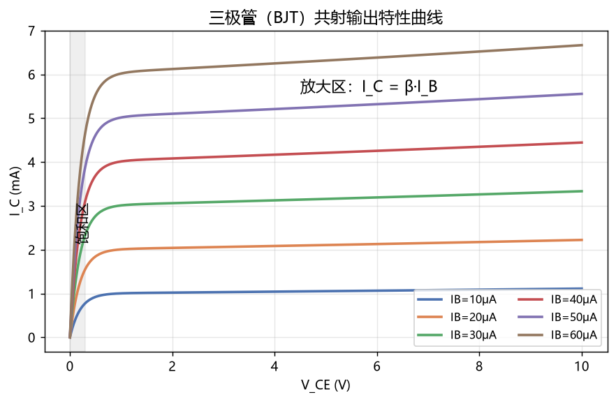

# 模拟电子技术

> 科目：通信工程 ｜ 收录日期：2026-08-17 ｜ 来源：知识123/通信工程知识库

> 模电研究"用小信号控制大能量"：放大、振荡、稳压。学完你能看懂收音机和音频功放的电路图。

---

## 一、知识地图

```
模拟电子技术
├── 半导体基础：PN结 → 二极管
├── 三极管 BJT：放大原理、三个工作区
├── 放大电路：共射/共集/共基、静态工作点Q、微变等效
├── 场效应管 FET：压控型放大（集成电路主流）
├── 负反馈：四种组态、深度负反馈计算
└── 集成运放：虚短虚断、同相/反相放大、有源滤波
```

---

## 二、二极管：单向阀门


**伏安特性（肖克利方程）**：i = I_s(e^(u/nVT) − 1)

- 正向：硅管约 **0.7V** 开始导通（锗管 0.3V），导通后微小电压变化引起巨大电流变化（指数）；
- 反向：近似截止；反压过大 → 击穿（稳压二极管就是工作在击穿区！）。

### 例题 1：限幅电路

**题目**：硅二极管 D 与 1kΩ 电阻串联接 5V 电源（D 正接）。求电流。

**详解**：D 导通压降 0.7V → 电阻分到 4.3V → I = 4.3V/1kΩ = **4.3mA**。

### 例题 2：稳压管

**题目**：稳压管 Uz=6V，与 R=500Ω 串联，输入 10V，负载开路。求 R 上电流。

**详解**：稳压管反向击穿稳压 6V → R 分到 4V → I = 8mA；负载接上后分流，但只要总电流不超过允许范围，输出稳定在 6V。**这就是最简单的稳压电源。**

> **通信应用**：二极管还可以检波（AM 解调）、开关（高速数字电路）、变容二极管（压控调谐，电调谐收音机）。

---

## 三、三极管 BJT：电流放大器



### 3.1 三个工作区（判断题必考）

| 工作区 | 条件 | 用途 |
|---|---|---|
| 放大区 | 发射结正偏、集电结反偏 | 放大器（i_C = β·i_B） |
| 饱和区 | 两结均正偏，u_CE≈0.3V | 数字电路"开" |
| 截止区 | 两结均反偏 | 数字电路"关" |

**记忆**：NPN 管放大条件——基极电位比发射极高 0.7V，集电极电位最高。

### 3.2 共射放大电路（模电的主角）

**两个分析步骤**：

1. **静态分析（直流通路）**：电容开路，求 Q 点。
   - I_BQ = (V_CC − 0.7)/R_b
   - I_CQ = β·I_BQ
   - U_CEQ = V_CC − I_CQ·R_c
2. **动态分析（交流通路）**：电容短路、直流源置零，用微变等效电路。
   - 电压增益 A_u = −β·R'_L / r_be（**负号=输出反相180°**）
   - 输入电阻 R_i = R_b∥r_be；输出电阻 R_o ≈ R_c

### 例题 3：静态工作点计算（最经典考题）

**题目**：V_CC=12V，R_b=300kΩ，R_c=3kΩ，β=50，r_be=1kΩ，负载 R_L=3kΩ。求 Q 点和电压增益。

**详解**：
1. I_BQ = (12−0.7)/300k ≈ 0.038mA = 38μA
2. I_CQ = 50×0.038 = 1.9mA
3. U_CEQ = 12 − 1.9×3 = 6.3V（在电源一半附近 → Q 点合适 ✓）
4. 交流负载 R'_L = R_c∥R_L = 1.5kΩ
5. A_u = −50×1.5/1 = **−75 倍**（负号表示反相）

**Q 点为什么重要**：设太高→饱和失真（输出底部削平）；设太低→截止失真（顶部削平）。示波器上一看削波就知道 Q 点不对。

### 例题 4：失真判断

**题目**：例题3电路输出波形顶部削平，是什么失真？怎么调？

**详解**：NPN 共射放大器，顶部削平 = 截止失真（I_BQ 太小）→ **减小 R_b** 提高 I_BQ。（若底部削平则是饱和失真 → 增大 R_b。）

---

## 四、场效应管 FET（一句话）

BJT 是**电流控制**（i_B 控制 i_C），FET 是**电压控制**（u_GS 控制 i_D）：输入阻抗极高（10⁹Ω+）、噪声小、功耗低——手机 CPU 里上亿个晶体管全是 MOSFET。

---

## 五、负反馈（模电的"灵魂"）

把输出的一部分送回输入削弱输入量。**四种组态**：电压串联、电压并联、电流串联、电流并联。

** sacrifice 口诀（牺牲增益换一切）**：引入负反馈后
- 增益下降（1+AF 分之一）——代价；
- 增益稳定性↑、通频带展宽、非线性失真↓、输入输出阻抗按组态改善——全是好处。

深度负反馈（1+AF≫1）时：闭环增益 A_f ≈ 1/F，**只由反馈网络（电阻）决定，与管子参数无关**——这就是运放电路精确的根源。

### 例题 5：反馈组态判断

**题目**：输出电压经 R_f 接回输入端与输入信号并联。是什么反馈？

**详解**：输出侧取"电压"、输入侧"并联" → **电压并联负反馈**；效果：稳定输出电压、减小输入电阻和输出电阻。

---

## 六、集成运放与"虚短虚断"（做题神器）

理想运放：开环增益∞、输入电阻∞。两条黄金法则：

- **虚短**：u₊ ≈ u₋（两输入端电位相等）
- **虚断**：i₊ ≈ i₋ ≈ 0（输入端不取电流）

### 例题 6：反相放大器（必考）

**题目**：反相端输入经 R1=1kΩ，反馈电阻 R_f=10kΩ。求增益。

**详解**：
1. 虚断 → 电流全走 R1 到 R_f：i1 = u_i/R1；
2. 虚短 → u₋ = u₊ = 0V（"虚地"）；
3. u_o = −i1·R_f = −(R_f/R1)·u_i → **A_u = −10 倍**。
4. 输入电阻 = R1 = 1kΩ。

### 例题 7：同相放大器与电压跟随器

**题目**：同相输入，R1=1kΩ，R_f=9kΩ 接地端。求增益。

**详解**：A_u = 1 + R_f/R1 = 1+9 = **+10 倍**（不反相、输入电阻极高）。
若 R_f=0、R1=∞ → A_u=1，即**电压跟随器**：阻抗变换用（缓冲器）。

### 例题 8：加法器（音频混音的原理！）

**题目**：三路输入 u1、u2、u3 各经 10kΩ 接反相端，R_f=10kΩ。求输出。

**详解**：虚地 → 三路电流相加流过 R_f → u_o = −(u1+u2+u3)。调不同 R 可做加权混音——**调音台的核心**。

> **通信应用**：运放做有源滤波器（低通/带通）、比较器（1bit 量化）、模拟乘法器（混频、同步检波）。

---

## 七、易错点清单

1. 静态用直流通路（电容开路），动态用交流通路（电容和直流源短路）——两个电路别混。
2. 共射放大输出与输入**反相**，别丢负号。
3. 虚短成立的前提是**负反馈闭环**；开环或正反馈时运放输出直接饱和。
4. 稳压管工作在**反向击穿**区；普通二极管打死不能反向击穿。
5. PNP 管的一切电压方向与 NPN 相反。

---

## 相关章节
- 上一章：[02-电路分析](../02-电路分析/知识点与例题详解.md)
- 下一章：[04-数字电子技术](../04-数字电子技术/知识点与例题详解.md)
- 振荡器/混频 → [09-高频电子线路](../09-高频电子线路/知识点与例题详解.md)

## 相关笔记

- [[通信工程总索引]]
- [[电路分析]]
- [[高频电子线路]]
