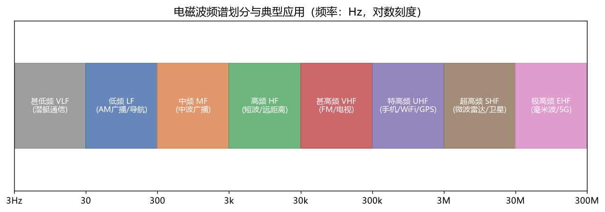

# 电磁场与电磁波

> 科目：通信工程 ｜ 收录日期：2026-08-17 ｜ 来源：知识123/通信工程知识库

> 这门课回答"信号怎么在空间里跑"：麦克斯韦方程 → 电磁波 → 天线 → 传输线。WiFi、5G、卫星、雷达的理论根基。

---

## 一、知识地图

```
电磁场与电磁波
├── 静态场：静电场/恒定电场/恒定磁场（基础概念）
├── 麦克斯韦方程组：全书的"牛顿三定律"
├── 均匀平面波：传播、极化、趋肤效应
├── 反射与折射：入射角/临界角/全反射
├── 传输线：特征阻抗、驻波、匹配（史密斯圆图）
├── 波导与谐振腔：微波传输
└── 天线：方向图、增益、有效面积
```

---

## 二、麦克斯韦方程组（只需懂物理意义）

| 方程 | 积分形式（物理故事） |
|---|---|
| 安培-麦克斯韦定律 | ∮H·dl = I + dΦ_D/dt：**电流和变化的电场都能产生磁场** |
| 法拉第定律 | ∮E·dl = −dΦ_B/dt：**变化的磁场产生电场**（发电机原理） |
| 高斯定律 | ∮D·dS = Q：电荷是电场的源 |
| 磁高斯定律 | ∮B·dS = 0：不存在磁单极子 |

**核心思想**：变化的电场生磁场，变化的磁场生电场 → 手拉手向前跑 → **电磁波**！麦克斯韦算出波速 = 1/√(μ₀ε₀) = 光速，发现"光就是电磁波"。



---

## 三、均匀平面波

### 3.1 基本性质

- E、H、传播方向三者互相垂直（右手螺旋）；
- **波阻抗** η₀ = √(μ₀/ε₀) ≈ 377Ω（自由空间）；E/H = η₀；
- 相速 v = 1/√(με)：真空 3×10⁸ m/s，一般介质中变慢；
- **坡印廷矢量** S = E×H：功率流密度（W/m²），方向=传播方向。

### 例题 1：场强与功率密度换算（工程天天用）

**题目**：空间某点电场强度 1 V/m，功率密度多少？

**详解**：S = E²/η₀ = 1²/377 ≈ **2.65 mW/m²**（这就是 WiFi/广播"场强 μV/m 与 dBm 换算"的来源）。

### 3.2 极化（波的"振动方向"）

| 极化 | 特征 | 应用 |
|---|---|---|
| 线极化 | E 始终在一条线 | 电视天线要摆对方向 |
| 圆极化 | E 端点画圆（左/右旋） | 卫星（克服姿态方向性）、GPS |
| 椭圆极化 | 一般情形 | 穿透/反射后多半变这样 |

> **生活实验**：3D 眼镜是圆极片；转动手机改变 WiFi 天线极化方向，信号强度会变——正交极化隔离可达 20dB 以上（极化复用 ×2 容量的原理）。

### 3.3 趋肤效应

高频电流集中在导体表面，趋肤深度 δ = √(2/(ωμσ))。频率越高 δ 越薄：
- 50Hz 铜线 δ≈9.3mm；1GHz 时 δ≈2.1μm！
- 后果：高频电阻大增 → 射频用镀银线、空心管、利兹线；pcb 高频走线要算趋肤损耗。

---

## 四、反射、折射与全反射

**斯涅尔定律**：n₁sinθᵢ = n₂sinθₜ。
**菲涅耳公式**决定反射多少（垂直入射空气→玻璃反射约 4%——相机镜头镀膜的由来）。

### 例题 2：光纤临界角（通往光纤通信）

**题目**：纤芯 n₁=1.468，包层 n₂=1.462。临界角？

**详解**：sinθ_c = n₂/n₁ → θ_c = arcsin(1.462/1.468) ≈ **85.6°**。纤芯内光线以大于 85.6° 角射到界面就被全反射锁在纤芯里跑——光纤原理详见[12-光纤通信](../12-光纤通信/知识点与例题详解.md)。

### 例题 3：数值孔径

**题目**：接上题，光纤接收光锥的数值孔径 NA？

**详解**：NA = √(n₁²−n₂²) = √(1.468²−1.462²) ≈ **0.133**；最大接收角 α = arcsin(0.133) ≈ 7.6°。NA 越大越容易耦光（多模光纤 NA≈0.27），但模间色散也越大。

---

## 五、传输线（射频工程师的日常）

频率高了，导线不再是"导线"，而是分布参数系统。

### 5.1 关键概念

- **特征阻抗 Z₀**：同轴线 50Ω（射频）/75Ω（视频）；与长度无关，由结构决定；
- **反射系数 Γ = (Z_L−Z₀)/(Z_L+Z₀)**：负载匹配(Z_L=Z₀)时 Γ=0，功率全吸收；
- **驻波比 VSWR = (1+|Γ|)/(1−|Γ|)**：1 为完美匹配，工程要求 <1.5（天线指标）。

### 例题 4：失配损耗

**题目**：天线 VSWR=2，多少功率被反射？

**详解**：
1. |Γ| = (2−1)/(2+1) = 1/3；
2. 反射功率占比 = |Γ|² = **11.1%**；
3. 发射机 10W → 实际辐射 8.9W，还有 1.1W 折回来烧末级功放（所以要隔离器/环行器保护）。

### 例题 5：四分之一波长阻抗变换器

**题目**：50Ω 系统匹配 100Ω 负载，λ/4 传输线特性阻抗？

**详解**：Z₁ = √(Z₀Z_L) = √(50×100) ≈ **70.7Ω**。（只对单一频点完美匹配 → 宽带匹配要用多节/渐变线。）

---

## 六、天线（能量的"门"）

- **方向图**：主瓣、旁瓣、半功率波束宽度 HPBW；
- **增益 G**：相对全向天线的聚焦倍数（dBi）；
- **互易定理**：同一天线收发性能相同；
- **有效面积** A_e = λ²G/(4π)；**弗里斯公式**：P_r = P_t·G_t·G_r·(λ/4πd)²。

### 例题 6：自由空间链路预算（通信系统设计的起点）

**题目**：WiFi 路由器 100mW(20dBm)，天线增益 2dBi，距离 10m，接收天线 2dBi，f=2.4GHz。接收功率？

**详解**（全部用 dB 算，只加减）：
1. 自由空间损耗：L = 32.44 + 20lgd(km) + 20lgf(MHz) = 32.44 + 20lg0.01 + 20lg2400 ≈ 32.44 − 40 + 67.6 = **60dB**；
2. P_r = 20 + 2 + 2 − 60 = **−36 dBm**；
3. 对比接收灵敏度（如 −80dBm）→ 链路余量 44dB，非常健康。
> **链路预算 = 发射功率+增益−损耗−灵敏度余量**，基站规划、卫星链路都从这一行算式开始。

---

## 七、易错点清单

1. dB 与 dBm：dB 是比值，dBm 是绝对功率（1mW 基准），不能相加不同类。
2. 阻抗匹配是"复数匹配"（虚部也要消），不是阻值相等就完事。
3. λ/4 变换器只对设计频点有效；λ/2 线阻抗还原（不变换）。
4. 天线增益不是"放大"，是"方向性聚焦"（无源器件不产生能量）。
5. 近场（电抗场）≠ 远场（辐射场）：手机天线测量要在远场（r > 2D²/λ）。

---

## 相关章节
- 上一章：[07-通信原理](../07-通信原理/知识点与例题详解.md)
- 下一章：[09-高频电子线路](../09-高频电子线路/知识点与例题详解.md)
- 全反射 → [12-光纤通信](../12-光纤通信/知识点与例题详解.md)
- 无线应用 → [11-移动通信](../11-移动通信/知识点与例题详解.md)

## 相关笔记

- [[通信工程总索引]]
- [[移动通信]]
- [[光纤通信]]
