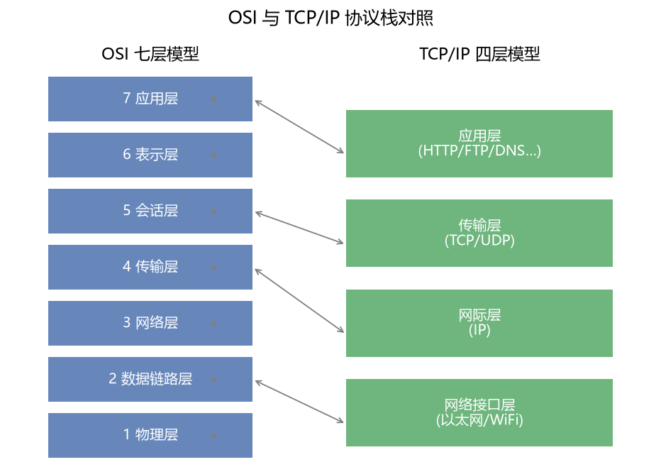
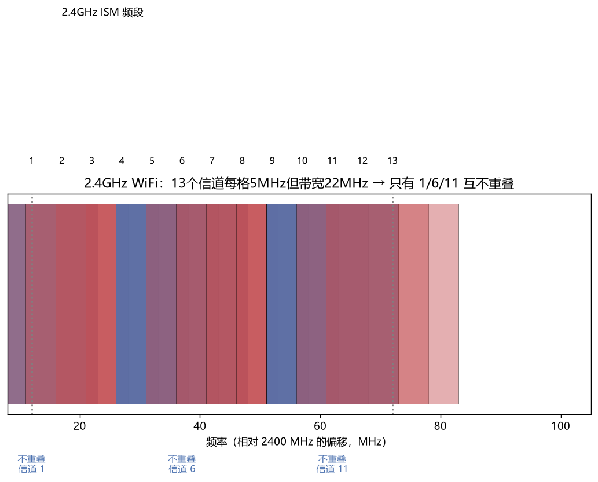

# 计算机网络

> 科目：通信工程 ｜ 收录日期：2026-08-17 ｜ 来源：知识123/通信工程知识库

> 网络是通信的"软件层"：IP 怎么路由、TCP 怎么保证可靠、DNS 怎么找域名。网络工程师岗位的核心课。

---

## 一、知识地图

```
计算机网络
├── 分层模型：OSI七层 / TCP-IP四层（图25）
├── 物理层与链路层：以太网帧、MAC、CSMA/CD、交换机
├── 网络层：IP地址/子网划分、路由算法、ARP/ICMP、NAT
├── 传输层：UDP、TCP三次握手/四次挥手/拥塞控制
├── 应用层：DNS/HTTP/HTTPS/DHCP/EMAIL
├── 无线网络：WiFi结构、CSMA/CA、信道（图26）
└── 网络安全基础：加密、证书、防火墙
```



---

## 二、分层模型（先把"楼层"背熟）

**为什么分层**：复杂问题拆解、各层独立演进（物理层从网线换WiFi，应用层无感）。

**记忆口诀**（OSI 自下而上）：**物-数-网-传-会-表-应**（屋里数网传，会表应用）。

数据发送时自上而下**加包头**（封装），接收时自下而上**拆包头**（解封装）——像信纸→信封→邮袋→集装箱。

---

## 三、数据链路层：以太网与 MAC

- **MAC 地址**：48bit 网卡物理地址（如 3C:5A:B4:...），局域网内寻址；
- **以太网帧**：目的MAC(6B)+源MAC(6B)+类型(2B)+数据(46~1500B)+FCS(4B CRC)；
- **CSMA/CD**（半双工）：先听后说-冲突退避（经典总线以太网）；交换机全双工后不再冲突，但**WiFi 仍用 CSMA/CA**（听不见碰撞，改为尽量避免+确认重传）；
- **交换机**：学习源MAC→建MAC表→按目的口转发（二层设备）。

### 例题 1：最小帧长

**题目**：经典以太网 10Mbps，最小帧 64 字节为什么这么定？

**详解**：冲突检测要求"发完之前能听到最远冲突"：往返时间 RTT=51.2μs（2500m中继段），64B×8bit/10Mbps = 51.2μs 恰好匹配——**帧太短就发完了还没检测到冲突**。千兆以太网为此引入载波扩展。

---

## 四、网络层：IP 与路由（考试大户）

### 4.1 IP 地址与子网划分（必考手工题）

IPv4 地址 32bit = 网络号 + 主机号；掩码 1 对应网络位。

| 类别 | 首字节范围 | 默认掩码 |
|---|---|---|
| A | 1~126 | /8 (255.0.0.0) |
| B | 128~191 | /16 |
| C | 192~223 | /24 |

**关键公式**：主机位 h → 可用主机数 = 2ʰ − 2（去网络地址与广播地址）。

### 例题 2：子网划分全流程

**题目**：把 192.168.10.0/24 划成 4 个子网，写出各子网范围与可用主机数。

**详解**：
1. 4 个子网需借 2 位 → 新掩码 /26（255.255.255.192）；
2. 每子网块大小 256/4 = **64**；子网：.0、.64、.128、.192 起；
   - 192.168.10.0/26：主机 .1~.62，广播 .63
   - 192.168.10.64/26：.65~.126，广播 .127
   - 192.168.10.128/26：.129~.190，广播 .191
   - 192.168.10.192/26：.193~.254，广播 .255
3. 每子网可用主机 = 2⁶−2 = **62 台**。

### 例题 3：判断同网

**题目**：主机A 10.1.2.5/22 与 B 10.1.3.200/22 是否同一网段？

**详解**：/22 块大小=4（第三字节步进4）：10.1.2.5 的网络 = 10.1.**2**.0/22（覆盖 2~5）；10.1.3.200 同样落在 10.1.**2**.0/22 → **同网段**（直接 ARP 通，不需路由器）。

### 4.2 其他必备

- **ARP**：IP→MAC 查询（广播问、单答回）；
- **路由器**：按最长前缀匹配查路由表转发（三层设备）；默认路由 0.0.0.0/0；
- **NAT**：私网地址(10/172.16/192.168)转公网——缓解 IPv4 枯竭；**IPv6**：128bit，地址多到"给每粒沙子编号"；
- **ICMP**：ping/traceroute 的载体。

---

## 五、传输层：TCP vs UDP（面试必问）

| | TCP | UDP |
|---|---|---|
| 连接 | 面向连接（三次握手） | 无连接 |
| 可靠性 | 确认重传、排序、流控 | 尽力而为 |
| 速度/开销 | 慢/20B头 | 快/8B头 |
| 应用 | 网页/文件/邮件 HTTP(S)/FTP/SMTP | 直播/游戏/DNS/语音 RTP |

### 5.1 TCP 三次握手（为什么不是两次？）

```
Client → SYN=x →           Server
Client ← SYN=y,ACK=x+1 ←   Server   （同时分配资源）
Client → ACK=y+1 →         Server
```

**两次不行**：老 SYN 迟到混入，服务器单方面建立"幽灵连接"白占资源；第三次确认让双方都证明"我发你收、你发我收"双向通。

**四次挥手**：FIN→ACK→FIN→ACK（被动方可能还有数据要发完，中间 ACK 与 FIN 分开）。

### 例题 4：TCP 序号与确认

**题目**：A 发 100 字节（seq=1000），B 正确收到。B 的 ACK 号？

**详解**：ACK = 1000+100 = **1100**（"1100 之前的都收到了"）。若中间丢 20 字节（SACK 场景），快速重传只补缺段——TCP 可靠性的核心就是"序号+确认+超时重传"。

### 5.2 拥塞控制四算法（概念题）

慢启动（指数涨）→ 拥塞避免（线性涨）→ 快重传（3个重复ACK）→ 快恢复。**AIMD**：加性增、乘性减——TCP 公平性的来源。

---

## 六、应用层

- **DNS**：域名→IP。递归查询（客户端→本地DNS）+迭代查询（本地DNS逐级问根/.com/权威）；缓存 TTL；
- **DHCP**：Discover(广播)→Offer→Request→ACK，自动拿 IP；
- **HTTP/HTTPS**：80/443 端口；HTTPS = HTTP + TLS（对称传数据+非对称换密钥+证书防中间人）；HTTP/2 多路复用、QUIC(UDP上建可靠传输，HTTP/3)；
- 端口记忆：FTP 21、SSH 22、HTTP 80、HTTPS 443、DNS 53、DHCP 67/68、SMTP 25、POP3 110。

### 例题 5：输入网址到看见页面（经典综合题）

**题目**：简述浏览器打开 `https://www.x.com` 的全过程。

**详解**（每步都是考点）：
1. DNS 解析：本地缓存→hosts→本地DNS→根→com→权威，得 IP；
2. TCP 三次握手建立连接（443 端口）；
3. TLS 握手：验证证书、协商密钥；
4. 发 HTTP 请求（GET /）→ 服务器返回 HTML；
5. 浏览器解析，继续 TCP/TLS 拉取 CSS/JS/图片，渲染呈现；
6. 关闭或复用连接（keep-alive）。

---

## 七、WiFi（无线上网全流程）



- 结构：STA(手机) + AP(路由器) + 关联/认证；
- **CSMA/CA**：无线听不到碰撞 → 发送前监听+随机退避+等待 ACK（没 ACK 就重传）；RTS/CTS 解决"隐蔽站"；
- 2.4GHz 14 信道中**只有 1/6/11 不重叠**（图26）——邻居家路由器挤信道，用工具换到干净信道；
- 安全：WPA2(PSK四次握手)/WPA3；**2.4G 穿墙好速度低，5G 速度高穿墙差**（波长/衰减规律，回看电磁场章）。

### 例题 6：双频选择

**题目**：路由器放客厅，卧室隔两堵墙。连 2.4G 还是 5G 看视频更流畅？

**详解**：两堵墙对 5GHz 衰减大（穿透差），若 5G 信号掉到 −75dBm 以下，实际速率可能低于 2.4G 的满格信号 → **远端选 2.4G，近处选 5G**；更好的方案是 Mesh 组网补覆盖。

---

## 八、易错点清单

1. 子网可用主机要 **−2**（网络地址+广播地址）。
2. 交换机转发用 **MAC**（二层），路由器用 **IP**（三层）——别混。
3. TCP 三次握手的第二次报文 SYN+ACK 一起发，挥手中间两步可能分开。
4. CSMA/CD 用于（旧式）有线，WiFi 用 CSMA/**CA**。
5. https 默认端口 443 不是 8080。

---

## 相关章节
- 上一章：[12-光纤通信](../12-光纤通信/知识点与例题详解.md)
- 码型/CRC → [04-数字电子技术](../04-数字电子技术/知识点与例题详解.md)
- 信道与容量 → [07-通信原理](../07-通信原理/知识点与例题详解.md)
- 全部课程总览 → `../README.md`

## 相关笔记

- [[通信工程总索引]]
- [[移动通信]]
